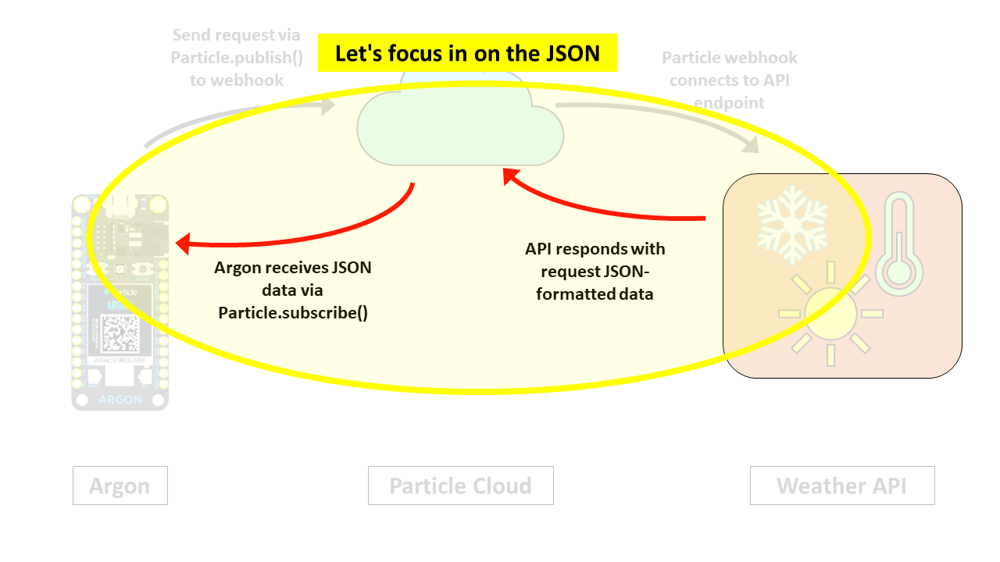
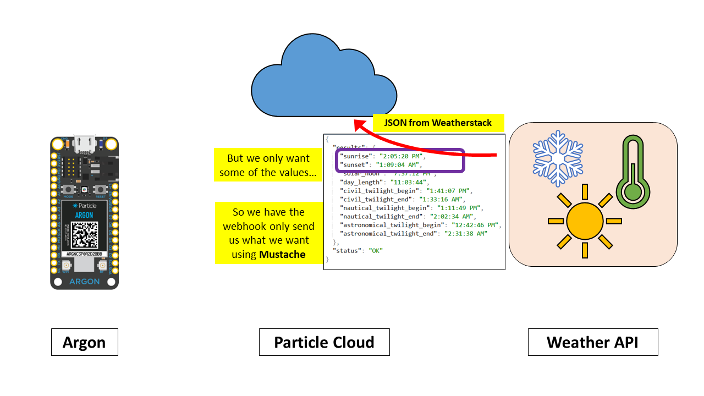
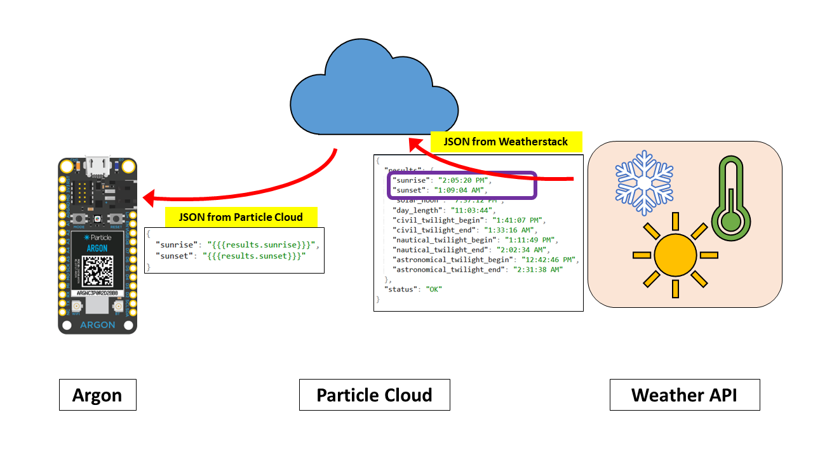
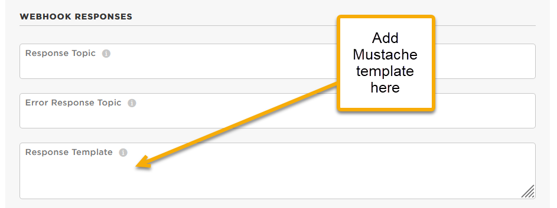

<!-- headingDivider: 2 -->

# Retrieving Data from APIs

## Overview

- APIs provide useful data we can use in our device (e.g. weather and location data)
- Each API will be configured slightly differently but the process to connect is generally similar

##  


##  


##  


##  


##  


## Steps to Connect Argon and API

0. Determine how to use the API
1. Create an integration -> webhook on [Particle console](https://console.particle.io/integrations) 
2. Use `Particle.publish` to trigger webhook
3. Use `Particle.subscribe` to "listen" for response from webhook
4. Create Mustache template that tells the Particle Cloud to which relevant data from the response should be to the Argon (and the rest of the data will be ignored)
5. Create **function handler** that is used by `Particle.subscribe` to process JSON

## Step 0: How to use the API

- Each API is different, but they will usually have documentation that describes how to connect
- Typically, this will include
  - Endpoint (URL you communicate with)
  - Parameters to include in your request (e.g. name of city you want weather data for)
  - How to obtain an API key (if necessary)

## Step 0: How to Use the API

Example: WeatherStack


## Step 1: Create Webhook In Particle Console

**Particle integration settings**


## Part 2: Publish Event to Trigger Webhook

**Argon firmware**

```c++
void loop() {
  String data = "90089";	//USC zip code
  
   // Trigger the integration
  Particle.publish("JSONWeatherStack", data, PRIVATE);
 
   // Wait 60 seconds
  delay(60000);
}

```

## Part 3: Subscribe to JSON response from Weather Stack

**Argon firmware**

```c++
void setup() {
  // Subscribe to the integration response event
  Particle.subscribe("hook-response/JSONWeatherStack",
                      jsonSubscriptionHandler, MY_DEVICES);
}
```

## Part 4 : Create Mustache template



## 


## 


## 


## 



## Part 4 : Create Mustache template

- Often we might only want a few items from the JSON, but the webserver sends the entire message
- This extra data can waste time, bandwidth, power, and the response size can create errors
- Instead, we can have Particle webserver send us only the data we actually want by creating **Mustache templates**

<!-- Inserting a variable with double braces {{a}} will do HTML escaping of the characters &<>"'. To avoid this, use triple braces {{{a}}} -->

## Example: Entire Weather Stack JSON Response


## Example: What if we only want the temperature?


### Creating Mustache Webhook Response Templates

**Particle Console Webhook**



## Example: Mustache Format


- If we are only interested in the `temperature` value which is nested in the `current` object, we could create a template like the following

```json
  {"temp":"{{{current.temperature}}}"}
```

- Now instead of the server sending entire JSON response, it will only send the following
```json
  {"temp":"61"}
```

- For webhook response templates, make sure the template will always result in valid JSON (i.e. `{"name":"value"}`)

## Part 5: Creating the function handler to receive and parse the JSON

* The last step is to create Argon code to handle / parse the JSON response
* While it is possible to manually parse JSON in C++, it is considered unsafe due to potential for security vulnerabilities
* **Instead, use one of the two popular Argon libraries below**
* [Instruction and examples for parsing JSON with `Ardui`](lecture_json_parsing_with_arduinojson.md)


<!--Since JSON is `String` data, it is possible to parse it using C-language techniques like `strtok`, `strcpy`, `atoi` 
However Buffer overrun if the response from the webserver was larger than expected or malformed-->


## Resources

* [Mustache Tester](https://rickkas7.github.io/mustache/)
* [Mustache Variable Reference](https://docs.particle.io/firmware/best-practices/json/#mustache-variables)
* [JSON Validator and formatter](https://jsonformatter.org/) 
* [Weatherstack documentation](https://weatherstack.com/documentation)

## Credits

* Photo by [Inset Agency](https://unsplash.com/@inset_agency?utm_source=unsplash&utm_medium=referral&utm_content=creditCopyText) on [Unsplash](https://unsplash.com/s/photos/rain-umbrella?utm_source=unsplash&utm_medium=referral&utm_content=creditCopyText)


<!--Alternate weather integration service
http://303.itpwebdev.com/~molld/assignment6/list.html
http://303.itpwebdev.com/~molld/assignment6/main.js
 -->