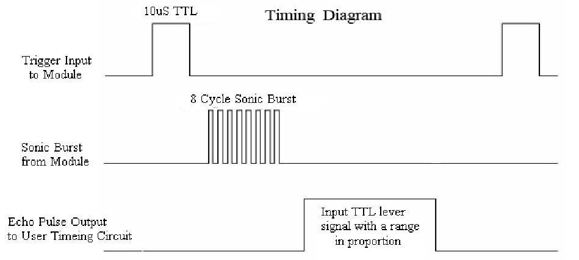

<!-- headingDivider: 2 -->

# Ultrasonic Distance Sensor


## Ultrasonic Distance Sensor

* Like SONAR! 
* Sends 40 KHz sound pulses (higher than human hearing)
* Waits for return sound wave ("echoes" or bounces off nearby objects)
* Distance to object can be calculated

## Uses

* Auto-range finder
* Self-parking cars
* Obstacle avoidance
* Autonomous vehicles
* Fun fact: This is how dolphins and bats navigate

## Parameters

* Operating range

  * 2 cm - 4 m (1 in - 13 ft)

* Angle

  * 15 degrees

  

## Sensor Pins

| Sensor | Argon      | Function                                                     |
| ------ | ---------- | ------------------------------------------------------------ |
| GND    | GND        | Ground                                                       |
| VCC    | VUSB       | Power **(requires 5v, but will work with 3.7V LiPo battery)** |
| TRIG   | Output Pin | start output pulse sequence                                  |
| ECHO   | Input Pin  | receive reflection response                                  |

## Timing Diagram


## Timing Part 1: Trigger

* Output sequence
  * LOW for 2 microseconds 
  * HIGH for 10 microseconds
  * LOW

```c++
delayMicroseconds(<<DELAY_VAL>>);
```

* Sensor sends out 8 sonic pulses

## Timing Part 2: Echo

* Sensor "listens" for sound wave to reflect / bounce off object
* When sound wave reflection is received, echo pin goes **HIGH** for duration of reflection, then goes **LOW**
* In order to measure the time it takes for an input to be received, use the ```pulseIn()```

## Measure Time with ```pulseIn```

* Syntax

```c++
//measure time in microseconds
//returns 0 if no signal received after 3 seconds
int time = pulseIn(<<PIN>>, <<VALUE>>); 
```
* Example

```c++
//Start timing when D2 is HIGH
//Stop timing when D2 is LOW
int time = pulseIn(D2, HIGH); 
```

## Calculating Distance

* ```pulseIn``` retuns the time for a signal to reach the nearest object and return
* How do we calculate the distance? Let's start with **cm**
* Speed of sound @ 20°C (68 ° F) = 343.5 m/s 

<!-- 
speed = dist/time -> dist = time*speed
convert speed from m/s to c/uS
  speed(m/s) * 100 (cm/m) * 1/10^6 (s/uS)
  speed = 0.03435 cm/uS
dist = 0.03435 * time  
NOTE: dist is the round trip time so divide by 2 for distance to object
CONV_FACTOR_CM_TO_IN = 0.3437
-->

## Cautions

* Sound waves can reflect off surfaces in room can give incorrect readings
* For example, air conditioning vents and other nearby ultrasonic sensors can cause interference
* There should be **500 ms** delay between readings

## Lab

* Download project: Go to [https://bit.ly/ProjectZip](https://bit.ly/ProjectZip)
* Paste the following link into the top right
  https://github.com/reparke/ITP348-Physical-Computing/tree/master/_exercises/week10/ultrasonic_oled_preloaded_bitmap_start

## Lab

* Connect the ultrasonic distance sensor
* Using the serial monitor, display
  * Error message when out of range
  * Warning message when less than 5 inches
  * Distance message otherwise

## Wiring Diagram


## Sensor Wiring

<span style="font-size:75%">

| Sensor | Argon |
| ------ | ----- |
| GND    | GND   |
| VCC    | VUSB  |
| TRIG   | D2    |
| ECHO   | D3    |

| OLED         | Argon |
| ------------ | ----- |
| GND          | GND   |
| 3V3          | 3V3   |
| SDA (Blue)   | SDA   |
| SCL (Yellow) | SCL   |

</span>

## Credit

- [Sparkfun](https://www.sparkfun.com/products/15569)
- [Sensor Datasheet](https://cdn.sparkfun.com/datasheets/Sensors/Proximity/HCSR04.pdf)

