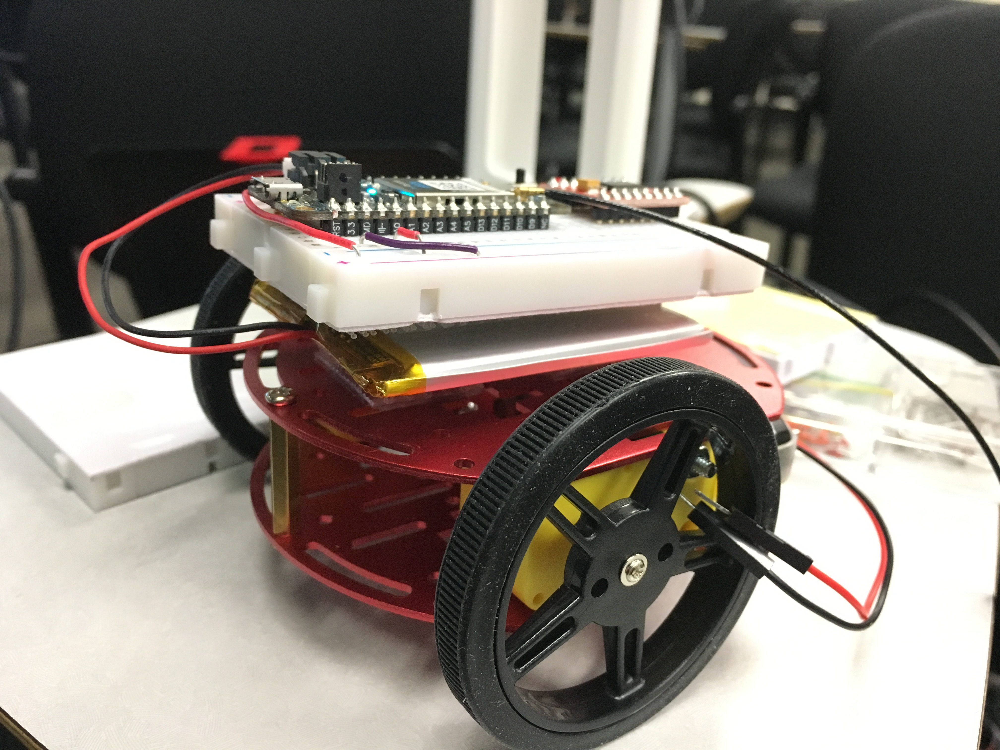

<!-- headingDivider: 2 -->

# Bluetooth Car

## Power Untethered

* Argon needs 3.3v to function
* DC hobby motors require 1-3v, but will handle up to 12v
* Best solution is to use LiPo battery which operates at 3.7v

## Lithium-Ion Polymer Battery (LiPo)

## Lithium-Ion Polymer Battery (LiPo)

* Operates at 3.7v (many other voltages available)
* Rechargeable
* Has a standard 2-pin JST-PH connector (also on Argon)
* Lightweight

## LiPo Capacity

* Besides voltage, batteries have a **capacity** rating
* **Capacity** is measured in **Amp hours**
* **Amp hours** are *"amount of current the battery can supply for an hour before it is drained"*
* Our batteries are **1800 mAh**
  * 1800 milliamp hours = 1.8 Amp hours
* Increased capacity --> increased size --> increased cost

## LiPo Special Cautions

* LiPo (like batteries in your cell phone) are generally safe
* However, please follow a few cautions:
  * Only charge with LiPo charger
  * Do not expose battery to water
  * Do not puncture
  * If punctured or swells, **stop using immediately**
  * Please **please** do not throw battery in the trash--it contains toxic metals that pollute the environment
  * You can drop the battery off at a [recycling center in your area](https://earth911.com/)

## LiPo and Argon

* Argon has built-in charging port for LiPo batteries
* Connect Argon to USB in order to charge battery

## New Argon Pins

* `EN` is a basically **on/off** for the Argon. Connect to **GND** to turn off Argon (and save battery power)
* `Li+` is internally-connected to the positive (+3.7v) of the battery

## Exercise: Assembling the Chassis

* Getting started

  * Download project: Go to [http://kinolien.github.io/gitzip/](http://kinolien.github.io/gitzip/)
  * Paste the following link into the top right
    https://github.com/reparke/ITP348-Physical-Computing/tree/master/_exercises/week11/ble_car_start

* Build chassis
  * [Assembly Instructions](guide_build_chassis)
  
  * Video: [Two-Layer Chassis Assembly](https://youtu.be/L7-98Ejmb4M)
  
    <!--[Pictures of installation](https://learn.sparkfun.com/tutorials/assembly-guide-for-sparkfun-jetbot-ai-kit/1-circular-robotics-chassis-kit-two-layer-assembly) (only relevant through half of the first page)-->

## Motor Controller Wiring Guide

| Motor Controller | Argon |  -- | Motor Controller | Argon |
| --------- | ---- | ---- | ---- | ---- |
| PWMA  | D8   |   | VCC              | 3v3 |
| AIN2  | D7   |    | GND | GND |
| AIN1  |   D6   |      |   VM   |   Li+   |
| BIN1  |   D5   |      |   STBY   |   3v3   |
| BIN2  |    D4  |      |      |      |
| PWMB |    D3  |      |      |      |

## Wiring Diagram

## Attaching the Battery

* The battery can be attached to either the top or bottom of the chassis, but to avoid damaging it, it is recommended to attach the battery to the top of the chassis
* The breadboard can then be attached to the battery

## References

* [Sparkfun](https://www.sparkfun.com/products/13853)
* [Particle](https://docs.particle.io/datasheets/wi-fi/argon-datasheet/)

* Images created with [Fritzing](https://fritzing.org/home/)