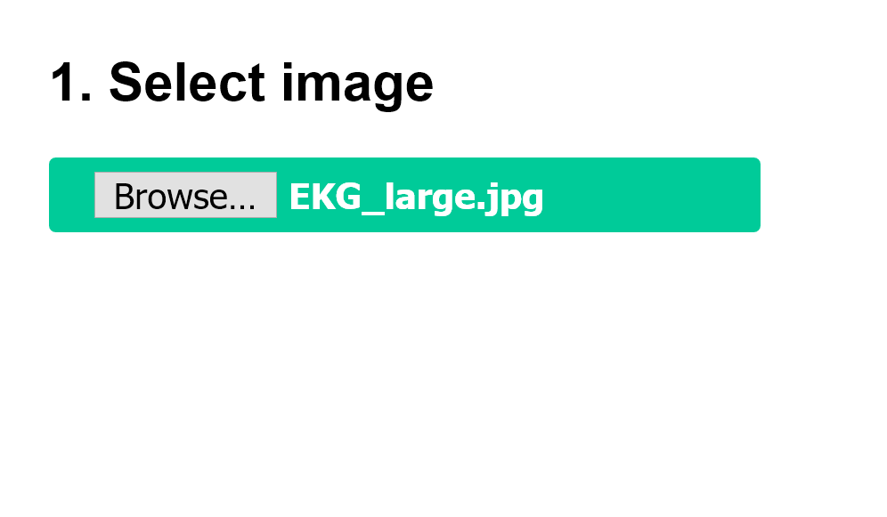
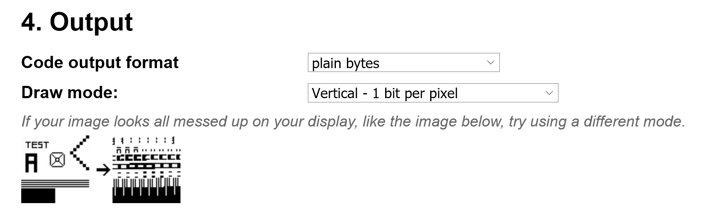
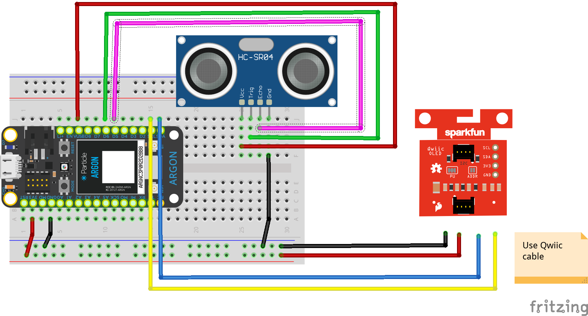

<!-- headingDivider: 2 -->

## OLED Screen Graphics


describe in one slide image vs canvas size


## Screen Parameters

* OLED screen consists of 64 (W) x 48 (H) pixels (3,072 total pixels)
* 3,072 pixels means 3,072 bits (ON or OFF) are needed to display a full image
  * 3,072 bits is 384 bytes (8 bits = 1 byte)
* Each pixel is either ON (HIGH) or OFF (LOW) because there is only one color
* We can display images on the screen in a **bitmap** format

## Pixels

| Original Image                                               | Image Closeup to Show Pixels                                 |
| ------------------------------------------------------------ | ------------------------------------------------------------ |
|  |  |

## Bitmap

* Bitmaps are stored as large arrays of bytes
* In a monochrome image, there is one bit per pixel
  * 64 pixel x 48 pixel images = 3,072 bits = 384 bytes
* Ex:

```c++
const uint8_t heart_bmp[] = { 
  0x00, 0x00, 0x00, 0x00, 
  0x00, 0x00, 0x00, 0x80, 
  0xe0, 0xf0, 0xf8, 0xfc, 
  ... }; 
```


## Creating Bitmaps

* Use a tool to convert image to byte array
* Color Restrictions
  * Each image to be converted should be black and white
  * Color and greyscale can work but not well
* Image Size
  * Use small or actual size images for better conversion to bitmap
## Example Images

| Original Black/White Image                                   | Bitmap on OLED                                               |
| ------------------------------------------------------------ | ------------------------------------------------------------ |
|  |  |

* Color white is what will be displayed on OLED


## Output Restrictions

* For SparkFun OLED, draw mode is `vertical - 1 byte per pixel`
* Sparkfun library requires that each bitmap be specified as 64x48 pixels or 384 bytes (**canvas size**)
  * This applies even if parts of the image is blank


## Ex: Converting Image with [Image2CPP](https://javl.github.io/image2cpp/)



## 


## 



## 


## Storing Byte Array 

* Create a `const uint8_t` array (byte array)

```c++
const uint8_t heart_bmp[] = { 
  0x00, 0x00, 0x00, 0x00, 
  0x00, 0x00, 0x00, 0x80, 
  0xe0, 0xf0, 0xf8, 0xfc, 
  ... }; 
```

* Use library to display bitmap

## Lab

* Convert `itp348.jpg` to bitmap and load as startup graphic (*image is in the starting folder*)
* Using the ultrasonic distance sensor, display graphics and distance measurement on the OLED
  * Large error graphic when out of range
  * Small warning message when less than 5 inches
  * Small graphics and distance message otherwise
* Bitmaps are provided in starting project folder 

   


## Wiring Diagram



<span style="font-size:75%">

| Sensor | Argon | Function                                                     |
| ------ | ----- | ------------------------------------------------------------ |
| GND    | GND   | Ground                                                       |
| VCC    | VUSB  | Power **(requires 5v, but will work with 3.7V LiPo battery)** |
| TRIG   | D6    | start output pulse sequence                                  |
| ECHO   | D5    | receive reflection response                                  |


| OLED         | Argon | Function |
| ------------ | ----- | -------- |
| GND          | GND   | Ground   |
| 3V3          | 3V3   | Power    |
| SDA (Blue)   | SDA   | Data     |
| SCL (Yellow) | SCL   | Clock    |

</span>

## Tools for converting images to bitmaps

* Online: [Image2CPP](https://javl.github.io/image2cpp/)
* Windows: [LCD Assistant](http://en.radzio.dxp.pl/bitmap_converter/)
* Mac: [bitmapToC](https://github.com/hoiberg/bitmapToC)

