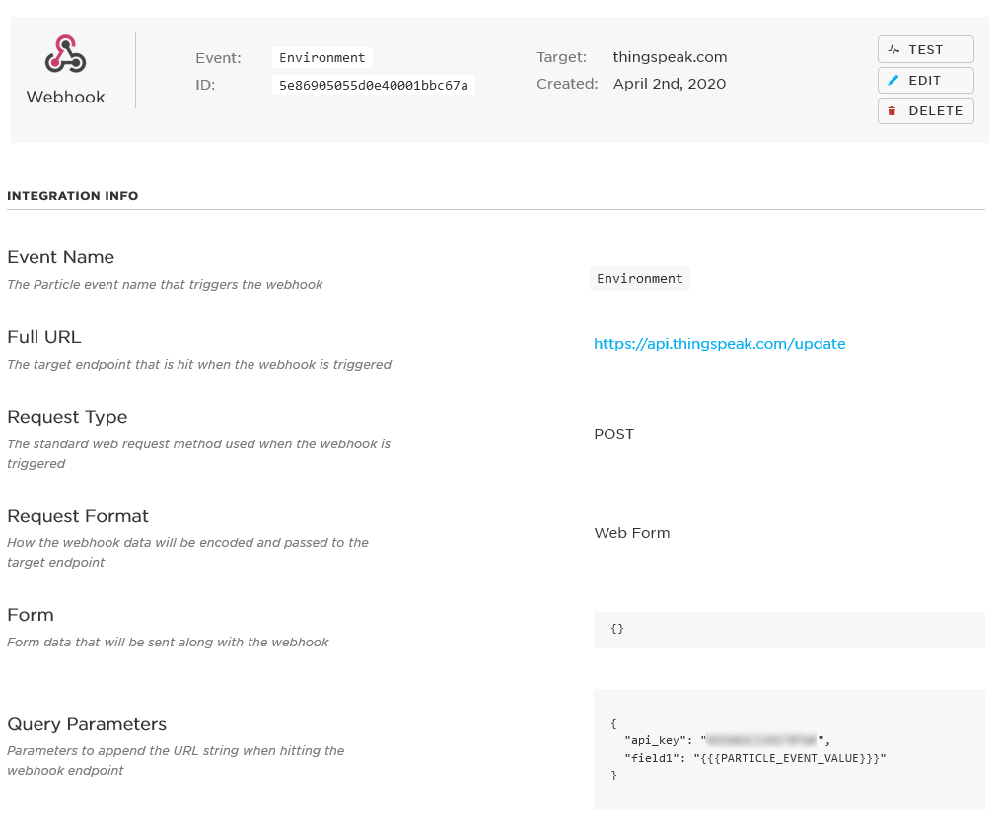
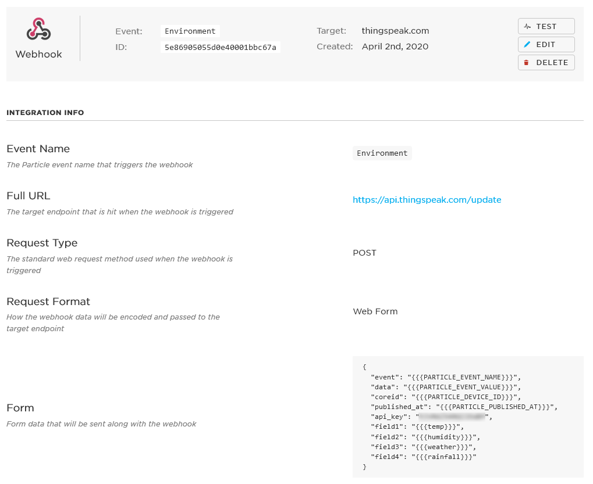

<!-- headingDivider: 2 -->


# ThingSpeak 

## ThingSpeak ([https://thingspeak.com](https://thingspeak.com))

* ThingSpeak is a web platform the IoT
* It allows you to send data from Argon to be stored at ThingSpeak
* You can create basic graphs and dashboard with the values from your Argon
* ThingSpeak also integrates with MATLAB for powerful data analytics

## Configuring Argon and ThingSpeak

* The following examples are provided as a quick reference
* More detailed steps were described in the lecture on 4/2/2020 and the video recording is available on Blackboard

## General Steps to Connect Argon and ThingSpeak

1. Create an integration -> webhook on [Particle console](https://console.particle.io/integrations) 

2. Create channel at [ThingSpeak](https://thingspeak.com)

3. Write firmware sketch and flash Argon

## Example 1: Send Single Data Point from Argon to ThingSpeak

**Particle integration settings**



## Example 1: Send Single Data Point from Argon to ThingSpeak

**ThingSpeak Channel Setttings**


## Example 1: Send Single Data Point from Argon to ThingSpeak

**Argon code**

```c++
double temp;

void loop() {
  temp = 89;		//just example; temp should come from sensor
  // Trigger the integration
  Particle.publish("Environment", String(temp), PRIVATE);
  delay(60000);	//use delay or millis to avoid publishing too frequently
}
```


## Example 2: Send Multiple Data PointsArgon to Thingspeak 

**Particle integration settings**



## Example 2: Send Multiple Data Points from Argon to Thingspeak 

**ThingSpeak channel settings**


## Example 2: Send Multiple Data PointsArgon to Thingspeak 

**Argon Code**

```c++
double temp;
double humidity;  
int rainfall;
String weather;

void loop() {
  //variables should read sensor data
  String data = "{ \"weather\": \"" + weather + "\"" +
                ", \"temp\": " + temp +
                ", \"humidity\": " + humidity +
                ",\"rainfall\": " + rainfall +
                "}";
  // Trigger the integration
  Particle.publish("Environment", String(data), PRIVATE);
  delay(60000);	//use delay or millis to avoid publishing too frequently
}
```

##  

 

`String data` variable will be in the following format

```json
{
"weather":"sunny"
"temp":76
"humidity":42
"rainfall":19
}
```

