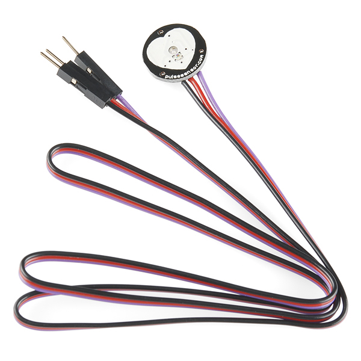

<!-- headingDivider: 2 -->


# Heart Rate Sensor


## Detecting Heart Rate



## Pulse Sensor Amped

* Measure heart rate on finger
* Green light useful (like Apple Watch)

## Pulse Sensor Amped MAX30101 Wiring

| Sensor | Argon      | Function              |
| ------ | ---------- | --------------------- |
| GND    | GND        | Ground                |
| VCC    | 3V3        | Power (requires 3.3v) |
| Data   | Analog Pin | Data                  |


## Library

- Argon-compatible library
  ```PulseSensorAmped```
- Configuration

```c++
#include <PulseSensorAmped.h>	//sensor library
const int PIN_PULSE = A4; // any analog pin


```

## Initialization

```c++
void setup() {
   PulseSensorAmped.attach(PIN_PULSE);
   PulseSensorAmped.start();
  
```

## Sensor Readings

- The beats per minute can be read by adding the following function

```c++
void PulseSensorAmped_data(int BPM, int IBI) {
 // BPM will be the parameter that is the current Beats Per Minute
 // IBI will be the parameter that is the current Interbeat Interval
}

```


## Other Useful Methods

- The following function will be called when the signal is lost

```c++
void PulseSensorAmped_lost(void) {

}
```

## Credits

- [Sparkfun](https://www.sparkfun.com/products/16474)