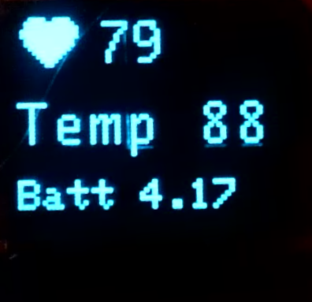
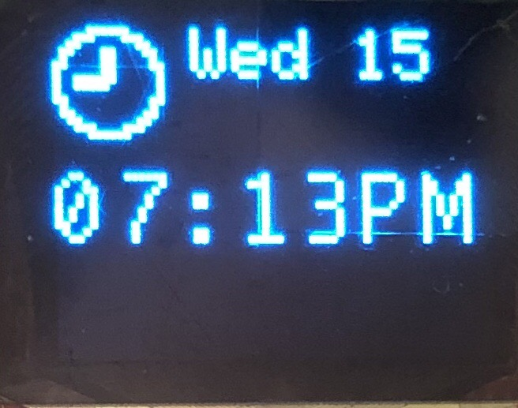
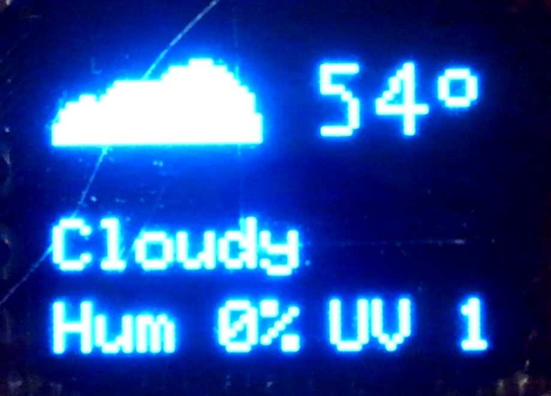

<!-- headingDivider: 2 -->


# Smart Watch


## Starting Project

  * For assembly and wiring, refer to [these instructions](guide_build_watch.md)
  * Download starting code: Go to [https://bit.ly/ProjectZip](https://bit.ly/ProjectZip)
    * Paste the following link into the top right
      https://github.com/reparke/ITP348-Physical-Computing/tree/main/_exercises/week12/smart_watch_pulse_sensor_start

  ## What's Included

  * Libraries
    * Micro OLED
    * Pulse Sensor Amped
  * Bitmaps byte arrays for heart rate, clock, and weather (`.h` files)
  * Heart rate BPM calculation

## Detecting Heart Rate with Pulse Sensor Amped

* Uses built-in LEDs to pulse light onto skin
* Measures light reflecting back
* Operates at 3.3v

##  States

* Three states: `TIME`, `WEATHER`, `HEART`
* Need to design `getNextState()` function
* Need to design `loadNextState()` function
* Need to support state transitions in `loop()`

## Heart Rate Screen




## Heart Rate Design Goals

* We want to always track heart beat so displayed as soon as heart screen loads (note: this is not power efficient)
* We also need to make sure the OLED screen doesn't update too often or the watch won't be able to read the pulse sensor fast enough

*If you want to display an image, you can use bitmap `heart16x12`*

## Time Screen



## Time

1. `setup()`

  * Set current timezone `Time.zone(<<TIMEZONE>>);` ([timezone guide](https://greenwichmeantime.com/time-zone/definition/))
  * Enable DST `Time.beginDST();`

2. Draw clock bitmap `clock_16x12`

3. Display date format  ([formatting guide](http://www.cplusplus.com/reference/ctime/strftime/))
    <!-- String dateFormat = "%a %d";-->
  ```c++
  oled.println(Time.format(<<DATE_FORMAT_STRING>>));
  ```

4. Display time format ([formatting guide](http://www.cplusplus.com/reference/ctime/strftime/))
    <!-- String timeFormat = "%I:%M%p"; -->

    ```c++
    oled.println(Time.format(<<TIME_FORMAT_STRING>>));
    ```

*If you want to display an image, you can use bitmap `clock_16x12`*

## Weather Screen




## GPS Coordinates for Precise Weather Data

- You can get weather data based on GPS coordinates
- You can use a [Google Maps + Particle web hook integration](https://docs.particle.io/tutorials/integrations/google-maps/) to get approximate GPS coordinates
- For now, you can use USC's zip code `90089`

## Weather Display

1. Create Particle webhook
2. Connect to weather API
3. Parse JSON
4. Display data
5. Use bitmaps byte array in `bitmaps_weather.h`

## Note on Weather Codes

- Weatherstack reports the weather conditions with a 3 digit code, which we can use to determine with image to display
- The full list can be found in the [API documentation](https://weatherstack.com/site_resources/weatherstack-weather-condition-codes.zip)
- For simplicity, you can use the follow abridged logic
  - Rainy weather codes: 296, 302, or 308
  - Cloudy weather codes: 116, 119, or 122
  - Snowing weather code: 227
  - Any other code can default to sunny 

## Important Reading

- [Racial Bias in Pulse Oximetry Measurement](https://www.nejm.org/doi/10.1056/NEJMc2029240)

## References

* [MAX30101 datasheet](https://cdn.sparkfun.com/assets/8/1/c/9/0/MAX30101_Datasheet.pdf)
* [Particle Argon reference - software timers](https://docs.particle.io/reference/device-os/firmware/argon/#software-timers)

## Credit

- [Measure Heart Rate Project](https://create.arduino.cc/projecthub/SurtrTech/measure-heart-rate-and-spo2-with-max30102-c2b4d8) 
