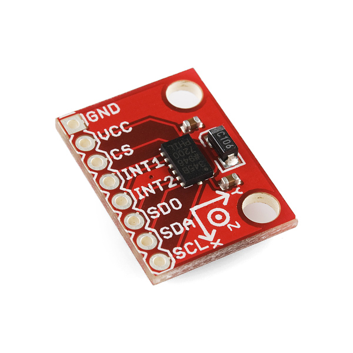
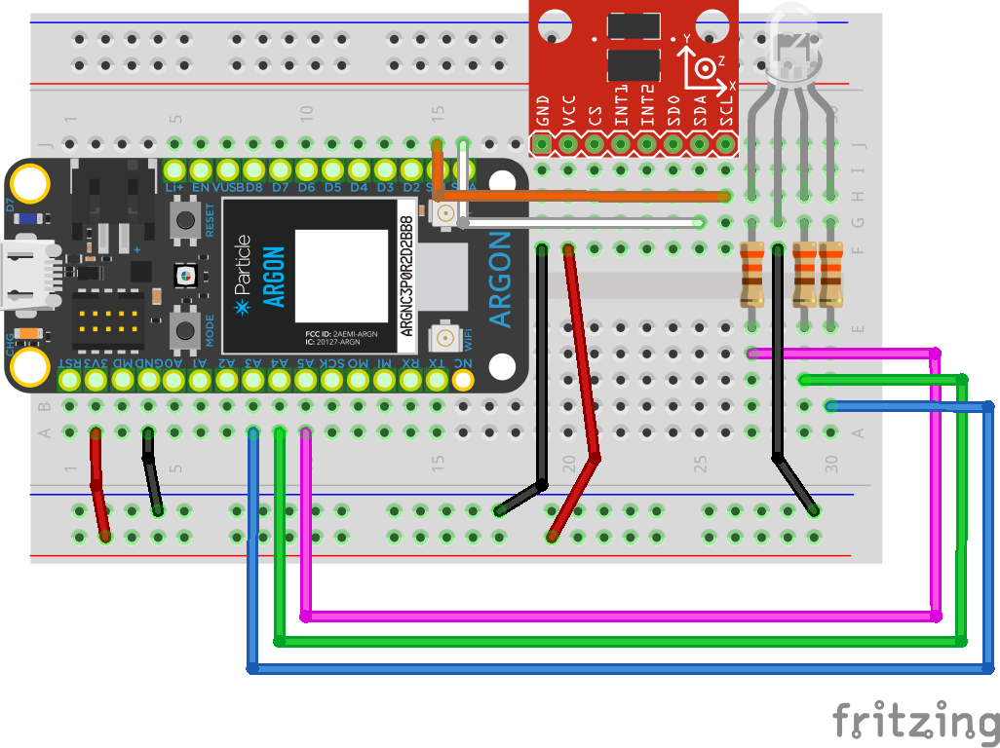

<!-- headingDivider: 2 -->

# Accelerometers



## Accelerometer

* Measures acceleration
  * Movement
  * Gravity 

* Model: ADXL345 

* Measurement range:  ±2g/±4g/±8g/±16g 
  * g = 9.8 m/s<sup>2<sup> (Earth's gravity)
* Uses I2C serial protocol

## Uses

* Tilting sensing
* Orientation detection (e.g. smart phone)
* Vibration sensing
* Motion (e.g. Wiimote)
  * Free fall

## Measurement

* Measures acceleration in X, Y, Z direction
* At least one direction will be to acceleration due to gravity at any given time. This is how the sensor "knows" what orientation it is in


## Related Sensors

* It can be confusing because there are multiple types of sensors that perform similar functions
* Other types of sensors are **gyroscopes** and **inertial measuring units**

## Gyroscopes


* Measure rotation in X, Y, Z (pitch, roll, yaw)
* Useful for flight guidance and autonomous vehicles

## IMU (inertial measurement unit)


* Combine accelerometer and gyroscope
* Detailed measurement of orientation, position, and velocity
* Provides up to nine degrees of freedom
* Useful for robotics

## Sensor Wiring

| Sensor | Argon        | Function                        |
| ------ | ------------ | ------------------------------- |
| GND    | GND          | Ground                          |
| VCC    | 3V3          | Power (requires 3.3v)           |
| CS     | 3V3          | Need for I2C mode               |
| SDO    | GND          | Need for I2C mode               |
| SDA    | SDA          | I2C data (no resistors needed)  |
| SCL    | SCL          | I2C clock (no resistors needed) |
| INT1   | Any GPIO Pin | Optional (if using interrupts)  |
| INT2   | Any GPIO Pin | Optional (if using interrupts)  |

## Sensor Wiring



## `ADXL345_Sparkfun_Particle` Library

* Initialize accelerometer object

```c++
ADXL345 adxl; 		//accelerometer object

void setup() {
  accel.powerOn(); // Power on the ADXL345
```

* There are other additional settings to configure tap, etc.
* These can be found in the example files in the library

## Library Operations

* Recommended library for Argon
  * ```ADXL345_Sparkfun_Particle```
* Check for vibrations
  * `accel.readTap()` 
  * `true` means vibration
* Measure acceleration
  * `accel.cx` int value for force of gravity in the X direction
  * `accel.cy` int value for force of gravity in the Y direction
  
  * `accel.cz` int value for force of gravity in the Z direction
  
  

## Library Operations

```c++
adxl.readAndCalcAccel();
float x = adxl.cx;		//get X-dir measurement (in G's)  
float y = adxl.cy;		  
float z = adxl.cz;		  
```

<!-- to register taps, use both
adxl.setTapDetectionOnXYZ(0, 0, 1);
adxl.singleTapINT(1);
-->

## Exercise 1

* Create new project
* Install library  `ADXL345_Sparkfun_Particle`
* Test library examples `Sparkfun_ADXL345_Graph.ino`

## Exercise 2

* Connect RGB LED
* Then change LED colors based acceleration
* Then turn on LED if there is vibration
* Change LED colors based on orientation

<!-- to try to make double tap + tap work, try this
adxl.setTapThreshold(40);
adxl.setTapDuration(32);
adxl.setDoubleTapLatency(80);
adxl.setDoubleTapWindow(240);
if (adxl.readDoubleTap() == true) 
else if (adxl.readTap() == true) {
-->

## Credit

- https://www.sparkfun.com/products/9836
- [Sensor Datasheet](https://www.sparkfun.com/datasheets/Sensors/Accelerometer/ADXL345.pdf)
- [Accelerometers, Gyros, IMUs](https://www.sparkfun.com/pages/accel_gyro_guide)
- Diagrams created with [Frizting](https://fritzing.org)

