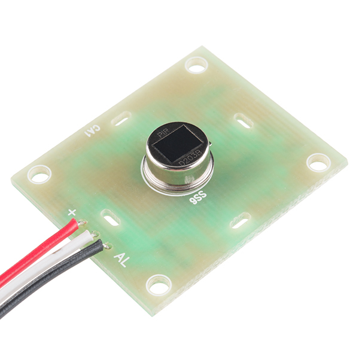
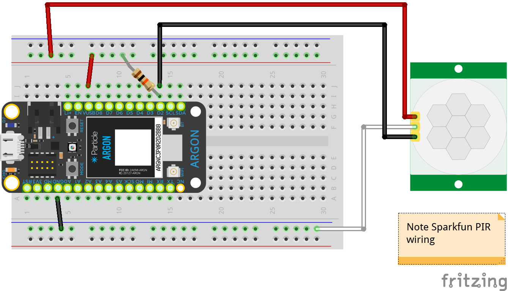

<!-- headingDivider: 2 -->

# PIR - Passive Infrared Sensor

  

## PIR 

* Human or animals will emit heat (as infrared radiation)
* Senses infrared waves to detect motion
* Uses
  * Alarms
  * Motion sensing cameras / lights
* Not a distance sensor

## PIR Specifications

* Distance range: up to 20 feet
* Detection range: ~110 degrees x 70 degrees
* Specifications vary by device and lens

## Components

* Main sensor is the small metal disc which detection infrared radiation
  

 ## Components
  * Clear / white lenses acts to focus a wider area of radiation onto the sensor to increase range 

## Operation (Sparkfun PIR)

* Requires 1-2 sec delay in `setup()` to get initial reading from room
* Digital output from `AL` pin
* `HIGH` when no movement detected
* `LOW` when movement detected
* Signal remains active `low` for about 3 sec **after** movement (*documentation says 15 sec but that doesn't seem accurate*)

## Other Common Parameters

* Other PIR sensors have different configurable options
  * Sensitivity (potentiometer): how much motion triggers alarm
  * Time adjust (potentiometer): how long after motion stops does signal remain active
  * Retriggering (switch / jumper): controls if alarm stays active for the same movement

## Wiring

| PIR (Sparkfun)      | Argon                                                    |
| ------------------- | -------------------------------------------------------- |
| + **(red wire)**    | 5v                                                       |
| - **(white wire)**  | GND                                                      |
| AL **(black wire)** | digital input pin  (with 10K pullup resistor to 5v) |

*Note: The wire color and pin order is specific to the [Sparkfun PIR sensor](https://www.sparkfun.com/products/13285) and not all PIR sensor*

## Wiring

## Lab

- Part 1: Connect sensor; turn on on-board LED when motion is detected and turn off when motion stops
- Part 2: Create a "hold length" of 5 sec whenever movement is detected

## Credit

* [Sparkfun](https://www.sparkfun.com/products/13285)
* Diagrams created with [Frizting](https://fritzing.org)

