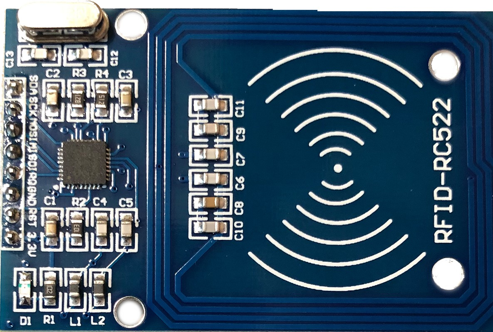

<!-- headingDivider: 2 -->

# RFID - Radio Frequency ID 




## Radio Frequency ID 

* Wireless technology identify devices
* RFID **tags** can be embedded in objects 
  * Can be passive (no power needed) or active (power/battery needed)
* RFID **readers** send a electromagnetic pulse (*radio frequency*), which triggers the tag to emit a response

## RFID Uses

* Inventory tracking
  * items, clothing, parts for manufacturing
* Access and identification
  * hotel key cards
  * ID cards (USC Card has an RFID tag)
* Contact-less payment
  * ApplePay uses NFC (near-field communication), which is a form of RFID

## RFID Sensor

* Sensors are designed to read cards are specific frequencies. 
  * Ours works at **13.56MHz**
* RFID sensors and cards must all use the same frequency
* Sensor communicates with Argon using **SPI**
* Operates at 3.3v

## RFID Cards and Fobs


* Each key card and key fob have a **unique code** stored in their RFID tag (e.g. `OB 45 EA 0E`)

  


## Sensor Wiring (SPI)

| Sensor | Argon                  |
| ------ | ---------------------- |
| 3.3v   | 3.3v                   |
| Reset  | Any digital output pin |
| GND    | GND                    |
| IRQ    | -                      |
| MOSI   | MO                     |
| MISO   | MI                     |
| SCK    | SCK                    |
| SDA    | Any digital output pin |

<!--This sensor has an SDA pin, but it is SPI, not I2C. It is really a data pin -->

## RFID Library

  * `MFRC522` is an Argon compatible library

## Sample Code #1: Find the Card ID

* The following code is adapted from the library example
* Swiping key card in front of sensor will display the unique ID from each card
* Once the card's unique ID is known, that ID can be used for tracking or identification (copy it from Serial monitor)

## Sample Code #1: Setup

```c++
#include "MFRC522.h"

const int SS_PIN = D2;
const int RST_PIN = D3'

MFRC522 mfrc522(SS_PIN, RST_PIN);  // Create MFRC522 object

void setup() {
  Serial.begin(9600); 
  mfrc522.setSPIConfig();
  mfrc522.PCD_Init();  // Init MFRC522 card
}

```

## Sample Code #1: Testing and Resting

```c++
void loop() {
  // Look for new cards (exit if no card is found)
  if (!mfrc522.PICC_IsNewCardPresent()) {
    return;
  }
  // Select one of the cards
  if (!mfrc522.PICC_ReadCardSerial()) {
    return;
  }
  // Dump info about the card. PICC_HaltA() is automatically called.
  Serial.println("About to dump");
  mfrc522.PICC_DumpToSerial(&(mfrc522.uid));
}

```

## Sample Code #2: Checking for Authorization

- Once you have the unique for one or more cards, that ID can then be used to provide authorized access
- Based on the card that is present, different outputs can be enable (e.g. doors unlocked)
- To proceed, you will need the unique ID form a card which will be something like  `OB 45 EA 0E`

## Sample Code #2: Setup

```c++
#include "MFRC522.h"

const int SS_PIN = D2;
const int RST_PIN = D3
const String MATCH_ID = "OB 45 EA 0E"; //target id to match

MFRC522 mfrc522(SS_PIN, RST_PIN);  // Create MFRC522 instance.

void setup() {
  Serial.begin(9600); 
  mfrc522.setSPIConfig();
  mfrc522.PCD_Init();  // Init MFRC522 card
  Serial.println("Scan PICC to see UID and type...");
}
```

## Sample Code #2: Match ID

```c++
String scanId = "";
if (mfrc522.PICC_IsNewCardPresent()) {    // check sensor
  if (mfrc522.PICC_ReadCardSerial()) {  // check valid read
    for (byte i = 0; i < mfrc522.uid.size; i++) {
      scanId += String(mfrc522.uid.uidByte[i] < 0x10 ? " 0" : " ");	       scanId += String(mfrc522.uid.uidByte[i], HEX);
     }
     scanId.toUpperCase();  //scanId will be lowercase
     scanId.trim();         //scanId has an intial leading " "
	//now we can check for a match!
    if (scanId == MATCH_ID) {
      //we found a match!
    }
  }
}
```

## Sample Code #2: Match ID Explained

- The ID is 4 bytes long and is read 1 byte at a time
- This code from the library assembles the ID into a String in *hexadecimal*

```c++
if (mfrc522.PICC_IsNewCardPresent()) {    // check sensor
  if (mfrc522.PICC_ReadCardSerial()) {  // check valid read
    for (byte i = 0; i < mfrc522.uid.size; i++) {
      scanId += String(mfrc522.uid.uidByte[i] < 0x10 ? " 0" : " ");	       scanId += String(mfrc522.uid.uidByte[i], HEX);
     }
```

## Sample Code #2: Match ID Explained

- `scanId` will be stored in lowercase with a leading space
  - Ex: ` _Ob 45 ea 0e` (*_ here is represents a space*)
- Since our `MATCH_ID` is upper case with no leading space, we modify `scanId`

```c++
scanId.toUpperCase();  //scanId will be lowercase
scanId.trim();         //scanId has an intial leading " "
```

## Wiring

| Sensor | Argon                   |
| ------ | ----------------------- |
| 3.3v   | 3.3v                    |
| Reset  | A5 (any GPIO pin works) |
| GND    | GND                     |
| IRQ    | -                       |
| MOSI   | MO                      |
| MISO   | MI                      |
| SCK    | SCK                     |
| SDA    | A4 (any GPIO pin works) |

## Diagram


## Lab

- Connect RFID
- Obtain IDs of two cards
- Create program to turn D7 LED on with one card and off with second card
- Use a `millis()` timer to pause 1 second between each card read

## Obtaining Sensors and Cards

* Sensor: [Amazon](https://www.amazon.com/gp/product/B01CSTW0IA)
* Key cards: [Amazon](https://www.amazon.com/gp/product/B01M0ACMDS)

## Credit

* [Sparkfun](https://www.sparkfun.com/products/13285)


