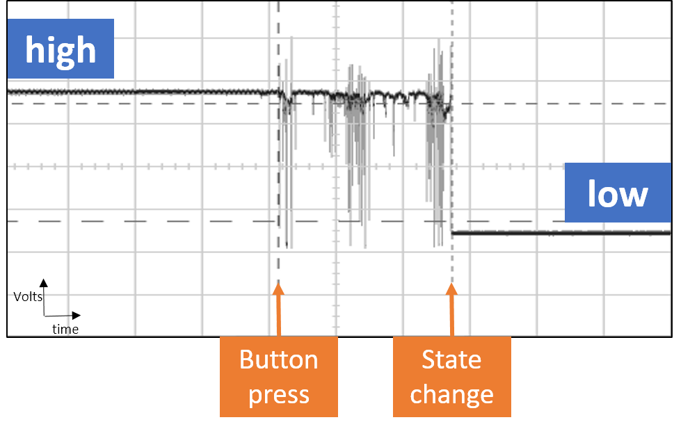
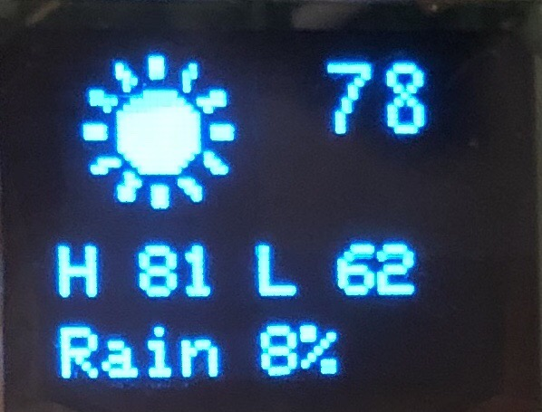

<!-- headingDivider: 2 -->


Left off: heart logic

todo: review debouncing logic

​	review starting code

# Smart Watch


## Todo

* describe MAX30102
* Describe I2C

## Plan

* Lecture 
  * how to get a button working
  * to work with graphics
  * how to work with the clock

*   Lecture
  * heart rate rate sensor
    * what is it
    * How does it work
    * how to program it
* Lecture
  * Connect to weather


## States

* Three states: `TIME`, `WEATHER`, `HEART`
* Need to design `getNextState()` function
* Need to support state transitions in `loop()`


## Problem with Buttons



* Buttons and switches are mechanical and they tend to fluctuate briefly when pressed
* Leads to circuit "bounce" before the value stabilizes
* Argon typically goes through `loop()` multiple times before this stops so we can get false buttons presses or incorrect values

## Solving Debouncing

* This works by only considering input if the signal has been stable (*the same*) for a fixed amount of time 
* Everytime we see the signal is "bounce", we reset our `millis()` counter
* Once we verify the signal has been stable for long enough, we then check for a button press
* We need to distinguish **current button reading** (which may be noisy) from **current button state** (which we have confirmed is a legitimate HIGH / LOW value)

## Debouncing Algorithm

* If current button reading is **not** the same as last button state
  * Reset debounce counter
* If signal has been stable long enough (currentTime-lastDebounce > debounceDelay)
  * If current button reading is different from current button state
    * Update button state (legitimate button press)
    * **Here you execute desired code for button presses**
* Update previous button state with the reading value

## Heart


## MAX30102 Heart Rate / SpO2 Sensor

==**How it works**==

## MAX30102 Wiring

| Sensor | Argon | Function              |
| ------ | ----- | --------------------- |
| GND    | GND   | Ground                |
| VCC    | 3V3   | Power (requires 3.3v) |
| SDA    | SDA   | I2C data              |
| SCL    | SCL   | I2C clock             |

## Heart Rate Goals

* We want to always track heart beat so displayed as soon as heart screen loads (note: this is not power efficient)
* We want to eliminate "noisy-ness" (flucutations) in heart rate so we will average the last for approximation of the heart rate (**smoothing**)

## Heart Rate Requirements

* Reading of the sensor needs to be fast in order for Argon to properly identify beat
* Updating the OLED is display is (relatively) slow
* Calculating actual heart rate average is also slow (uses for loop)
* Solution
  * Make reading from the sensor on a timer
* Timer ==have some background info here==
* Logic
  * Calculate most recent heart BPM
  * If heart rate is above a threshold
    * Display BPM
  * Else display `---`
  * Display body temperature

## Time


## Time

* Figure out and set timezone `Time.zone(TIMEZONE)`

  * https://greenwichmeantime.com/time-zone/definition/

* Enable DST `Time.beginDST()`

* Draw clock bitmap `clock_16x12`

* Figure out date format

  ```c++
  String dateFormat = "%a %d";
  oled.println(Time.format(dateFormat));
  ```

* Figure out time format

    ```c++
  String timeFormat = "%I:%M%p";
  oled.println(Time.format(timeFormat));
  ```

## Weather




## Starting Project

* For assembly and wiring, refer to [these instructions](guide_build_watch.md)
* Download starting code: Go to [https://bit.ly/ProjectZip](https://bit.ly/ProjectZip)
  * Paste the following link into the top right
    https://github.com/reparke/ITP348-Physical-Computing/tree/master/_exercises/week13/smart_watch_start

## What's Included

* Libraries
  * Micro OLED
  * MAX30102 heart rate sensor
* Bitmaps byte arrays for heart rate, clock, and weather (`.h` files)
* Heart rate BPM calculation


## Credit

- [Measure Heart Rate Project](https://create.arduino.cc/projecthub/SurtrTech/measure-heart-rate-and-spo2-with-max30102-c2b4d8) 
