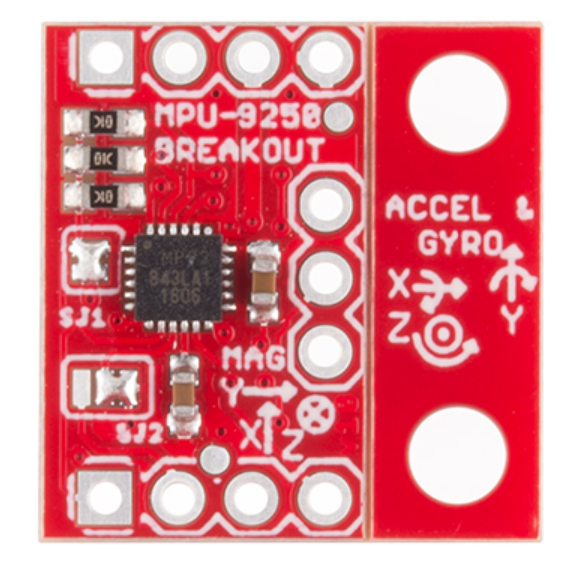

<!-- headingDivider: 2 -->

# Accelerometers


## Accelerometer

* Measures acceleration
  * Movement
  * Gravity 

* Model: MMA8452Q 

* Measurement range:  ±2g/±4g/±8g 
  * g = 9.8 m/s<sup>2<sup> (Earth's gravity)
* Uses I2C serial protocol

## Uses

* Tilting sensing
* Orientation detection (e.g. smart phone)
* Vibration sensing
* Motion (e.g. Wiimote)
  * Free fall

## Measurement

* Measures acceleration in X, Y, Z direction
* At least one direction will be to acceleration due to gravity at any given time. This is how the sensor "knows" what orientation it is in


## Related Sensors

* It can be confusing because there are multiple types of sensors that perform similar functions
* Other types of sensors are **gyroscopes** and **inertial measuring units**

## Gyroscopes


* Measure rotation in X, Y, Z (pitch, roll, yaw)
* Useful for flight guidance and autonomous vehicles

## IMU (inertial measurement unit)



* Combine accelerometer and gyroscope
* Detailed measurement of orientation, position, and velocity
* Provides up to nine degrees of freedom
* Useful for robotics

## Sensor Wiring

| Sensor | Argon | Function              |
| ------ | ----- | --------------------- |
| GND    | GND   | Ground                |
| VCC    | 3V3   | Power (requires 3.3v) |
| SDA    | SDA   | I2C data              |
| SCL    | SCL   | I2C clock             |


## Exercise 1

* [Download starting project](https://minhaskamal.github.io/DownGit/#/home?url=https://github.com/reparke/ITP348-Physical-Computing/tree/master/_exercises/week14/accelerometer_start)
* Connect sensor and run example code
* Recommended library for Argon
  * ```SparkFunMMA8452Q```

## Exercise 2

* Connect RGB LED
* Change LED colors based on orientation
* Then change LED colors based acceleration
* Then turn on LED if there is vibration

## Credit

- [Sparkfun](https://www.sparkfun.com/products/13926)
- [Sensor Datasheet](https://cdn.sparkfun.com/datasheets/Sensors/Accelerometers/MMA8452Q-rev8.1.pdf)
- [Accelerometers, Gyros, IMUs](https://www.sparkfun.com/pages/accel_gyro_guide)

