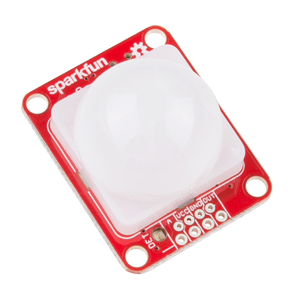
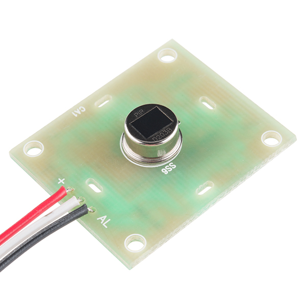
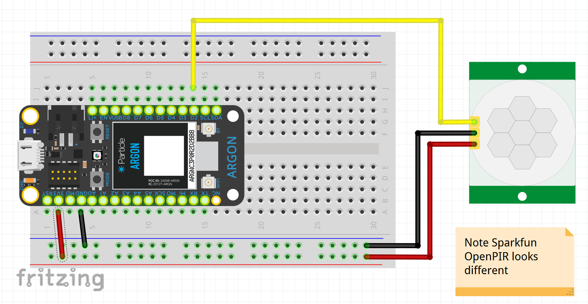

<!-- headingDivider: 2 -->

# Open PIR - Passive Infrared Sensor

  

## PIR 

* Human or animals will emit heat (as infrared radiation)
* Senses infrared waves to detect motion
* Uses
  * Alarms
  * Motion sensing cameras / lights
* Not a distance sensor

## PIR Specifications

* Distance range: up to 16 feet
* Detection range: ~110 degrees x 70 degrees
* Specifications vary by device and lens

## Components

* Main sensor is the small metal disc which detection infrared radiation
  

 ## Components
  * Clear / white lenses acts to focus a wider area of radiation onto the sensor to increase range 

## Operation (Sparkfun PIR)

* Requires 1-2 sec delay in `setup()` to get initial reading from room
* Digital output from `OUT` pin
* `HIGH` when no movement detected
* `LOW` when movement detected
* Sensitivy adjustment (screwdriver)
* Time adjustment (screwdriver)
* Single / dual swtich

## Sensitivity Adjustment (SEN) 

* Adjust the **view distance** of the OpenPIR
* Clockwise turn increase the distance the sensor sees
* you turn this trimpot, the further  your sensor should be able to see. When you receive the board, the  trimpot will be centered, and the sensor will react to a person moving  about in the 6 to 8 foot (2 to 2.5m) range. At the maximum sensitivity,  the sensor will detect a person walking by at about 16 feet (5m).Other PIR sensors have different configurable options
* Sensitivity (potentiometer): how much motion triggers alarm
* Time adjust (potentiometer): how long after motion stops does signal remain active
* Retriggering (switch / jumper): controls if alarm stays active for the same movement

## Time Adjustment (SEN) 

* Adjust the length of time the output remains HIGH. This trimpot is used to adjust the oscillator  frequency of the NCS36000. 
* Clockwise increases the length of time OUT remains high
* Time range: 400 ms to 7.5 s

## Retriggering

* Controls if alarm stays active for the same movement
* Single-pulse mode can be used to detect an object entering *or* exiting the PIR's field-of-view
* Dual-pulse detection can be used to detect an object entering *and* leaving the view area.

## Wiring

| PIR (Sparkfun) | Argon                 |
| -------------- | --------------------- |
| VCC            | 3.3v                  |
| GND            | GND                   |
| OUT            | digital input pi      |
| A              | (Optional) analog pin |

*Note: The wire color and pin order is specific to the [Sparkfun PIR sensor](https://www.sparkfun.com/products/13285) and not all PIR sensor*

## Wiring

## Exercise

- Part 1: Connect sensor; turn on on-board LED when motion is detected and turn off when motion stops
- Part 2: Create a "hold length" of 5 sec whenever movement is detected

## Credit

* [Sparkfun](https://www.sparkfun.com/products/13285)
* Diagrams created with [Frizting](https://fritzing.org)

