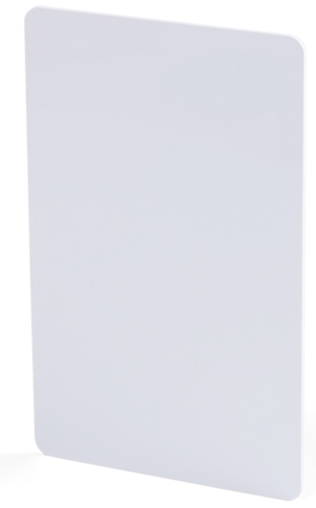

<!-- headingDivider: 2 -->

# RFID 

*This content is incomplete but provides some code examples to get started using RFID*


## Radio Frequency ID 

* Wireless technology identify devices
* RFID **tags** can be embedded in objects 
  * Can be passive (no power needed) or active (power/battery needed)
* RFID **readers** send a electromagnetic pulse (*radio frequency*), which triggers the tag to emit a response

## RFID Uses

* Inventory tracking
  * items, clothing, parts for manufacturing
* Access and identificato
  * hotel key cards
  * ID cards (USC Card has an RFID tag)
* Contact-less payment
  * ApplePay uses NFC (near-field communication), which is a form of RFID

## RFID Sensor

* Sensors are designed to read cards are specific frequencies. 
  * Ours works at **13.56MHz**
* RFID sensors and cards must all use the same frequency
* Sensor communicates with Argon using **SPI**
* Operates at 3.3v

## RFID Cards and Fobs




* Each key card and key fob have a unique code stored in their RFID tag

  


## Sensor Wiring

| Sensor | Argon                  |
| ------ | ---------------------- |
| 3.3v   | 3.3v                   |
| GND    | GND                    |
| Reset  | Any digital output pin |
| SS     | Any digital output pin |
| MOSI   | MO                     |
| MISO   | MI                     |
| SCK    | SCK                    |

## RFID Library

  * `MFRC522` is an Argon compatible library

## Sample Code

* The following code is adapted from the library example
* Swiping key card in front of sensor will display the unique ID from each card
* Once the card's unique ID is known, that ID can be used for tracking or identification

## Sample Code

```c++
#include "MFRC522.h"

const int SS_PIN = D2;
const int RST_PIN = D3'

MFRC522 mfrc522(SS_PIN, RST_PIN);  // Create MFRC522 instance.

void setup() {
  Serial.begin(9600); 
  mfrc522.setSPIConfig();
  mfrc522.PCD_Init();  // Init MFRC522 card
  Serial.println("Scan PICC to see UID and type...");
}

void loop() {
  // Look for new cards
  if (!mfrc522.PICC_IsNewCardPresent()) {
    return;
  }
  // Select one of the cards
  if (!mfrc522.PICC_ReadCardSerial()) {
    return;
  }
  // Dump info about the card. PICC_HaltA() is automatically called.
  Serial.println("About to dump");
  mfrc522.PICC_DumpToSerial(&(mfrc522.uid));
}

```


## Wiring

* Sensor: [Amazon](https://www.amazon.com/gp/product/B01CSTW0IA)
* Key cards: [Amazon](https://www.amazon.com/gp/product/B01M0ACMDS)

## Credit

* [Sparkfun](https://www.sparkfun.com/products/13285)


