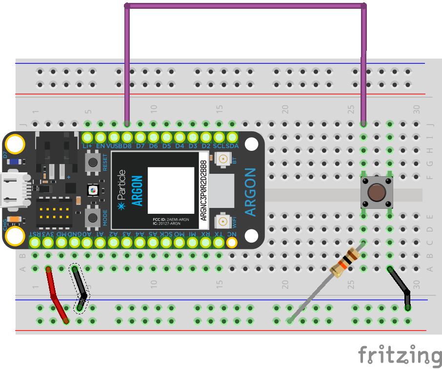

<!-- headingDivider: 2 -->

# Sleep and Wake Up

The three sleep modes are:

    STOP (most wake options, highest power)
    ULTRA_LOW_POWER (ULP)
    HIBERNATE (fewest wake options, lowest power)

You'll probably want to choose the lowest power option that has the options you need to wake. These are described in the sleep modes documentation.

Additionally, in HIBERNATE mode, the device wakes as if it has been reset. It goes through setup() again and starts with all non-retained variables cleared. In ULTRA_LOW_POWER and STOP modes, execution continues after the line of code that put the device to sleep, with all variables preserved.

## Credit

* Particle - About Sleep[https://docs.particle.io/tutorials/learn-more/about-sleep/](https://docs.particle.io/tutorials/learn-more/about-sleep/)
* [Particle - `sleep()` documentation](https://docs.particle.io/cards/firmware/sleep-sleep/sleep-sleep/)
* 

