<!-- headingDivider: 2 -->

# Next Steps

## Where to go from here?

- PCB design *(covered in ITP 388)*
- Microcontroller programming *(covered in ITP 388)*
- Movement
- Manufacturing
- Device fleet management
- Security
- Machine learning

## Breadboard with Solid Wires

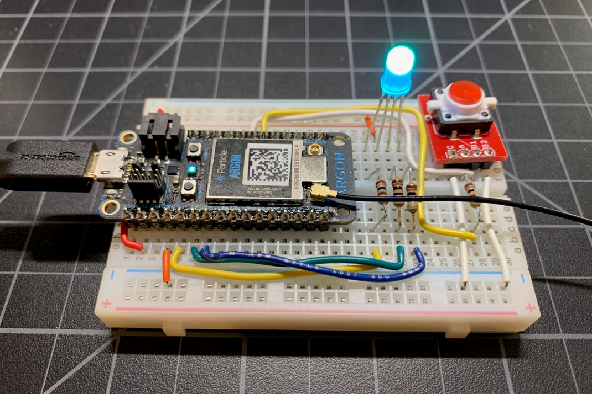

## Perma-Proto Board

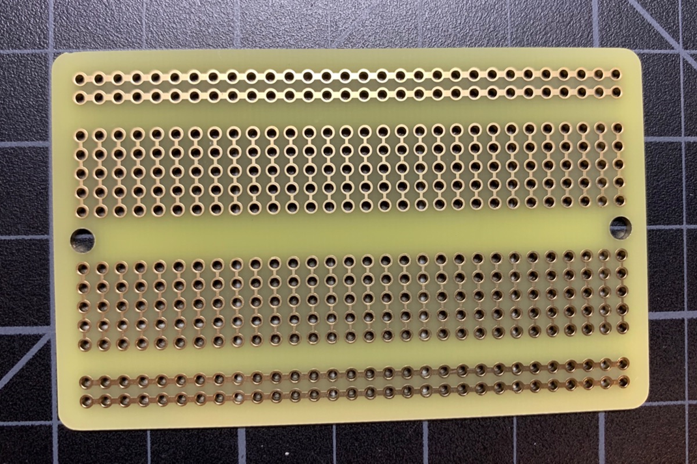

##  Perma-Proto Board

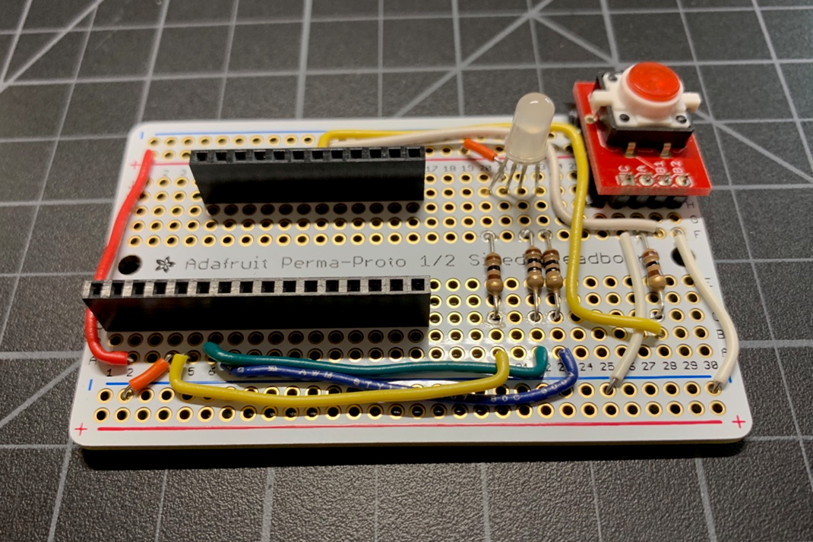

## Perma-Proto Board

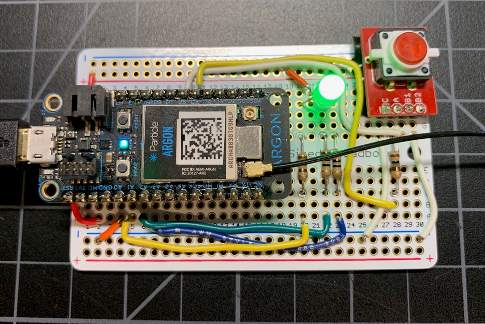

## Feather Perma-Proto Board

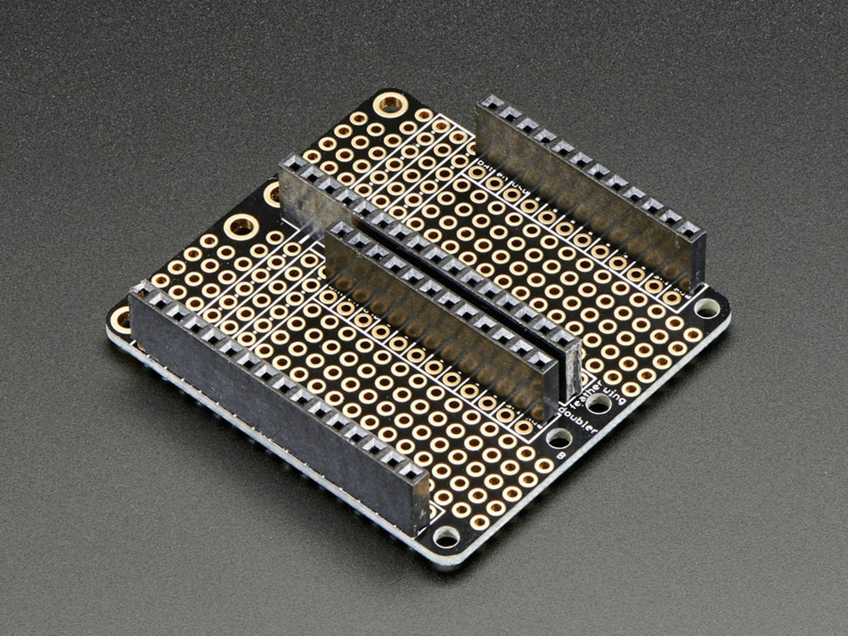

## Feather Perma-Proto Board

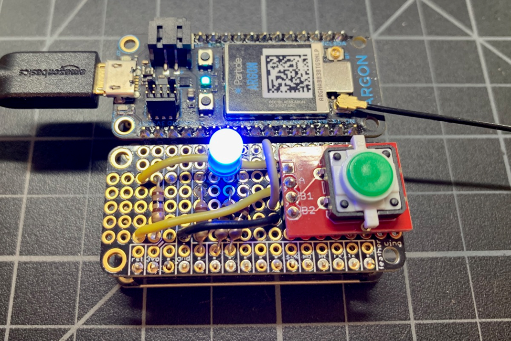

### Feather Plated Through Hole PCB

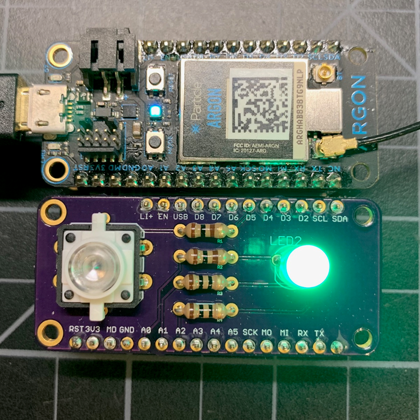

## Feather Plated Through Hole PCB

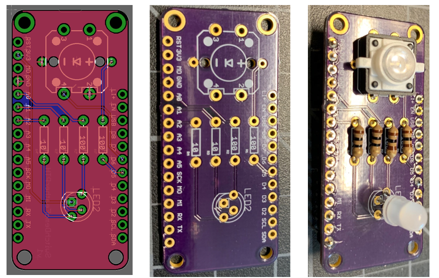

## Feather Surface Mount Device SMD

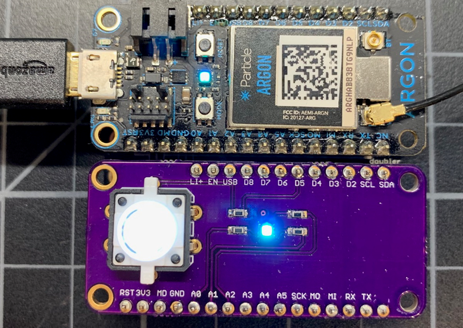

## Feather Surface Mount Device SMD

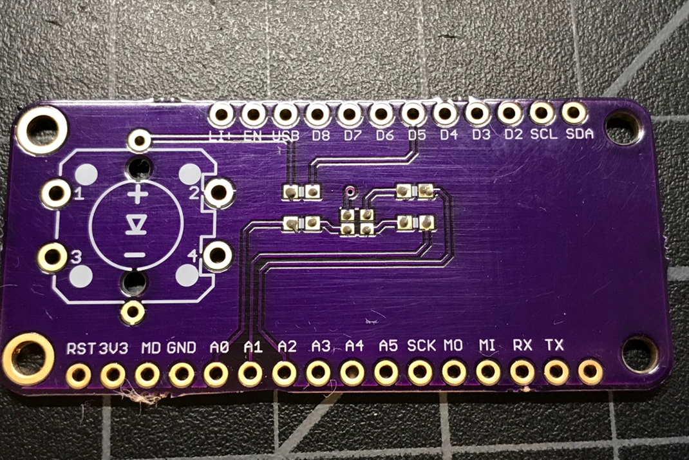

## Feather Surface Mount Device SMD

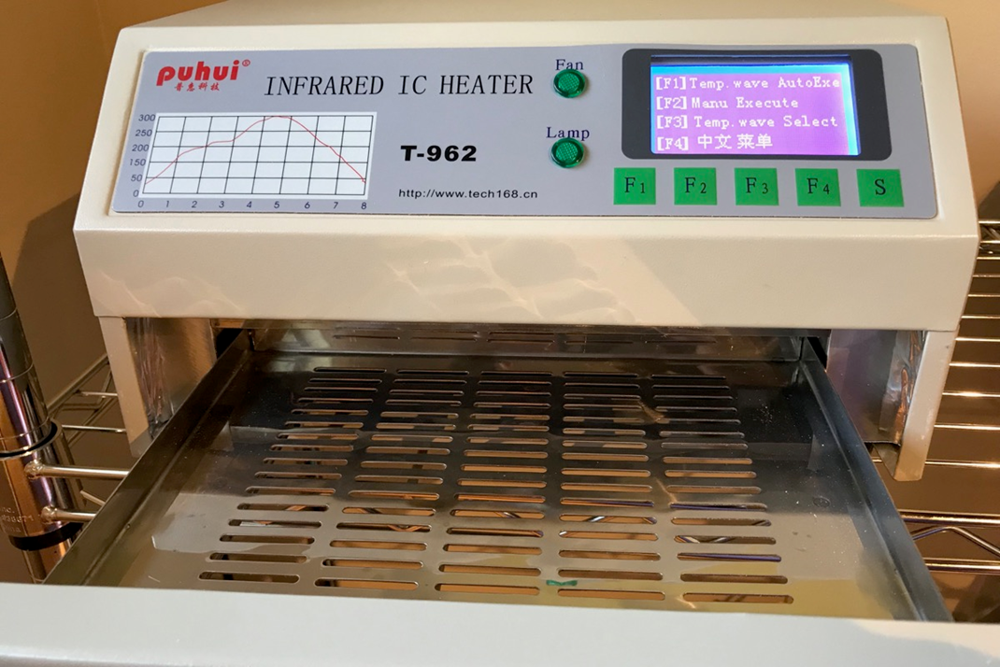

## Useful Links

* [JLCPCB PCB manufacturing](https://jlcpcb.com/)

## PCB Design Software

- [Altium](https://www.altium.com): expensive but free for students
- [KiCad](www.kicad.org)
- [Eagle](https://www.autodesk.com/products/eagle/overview?term=1-YEAR&tab=subscription)

## Credits

- [Particle](https://docs.particle.io/hardware/expansion/beyond-prototyping/)
