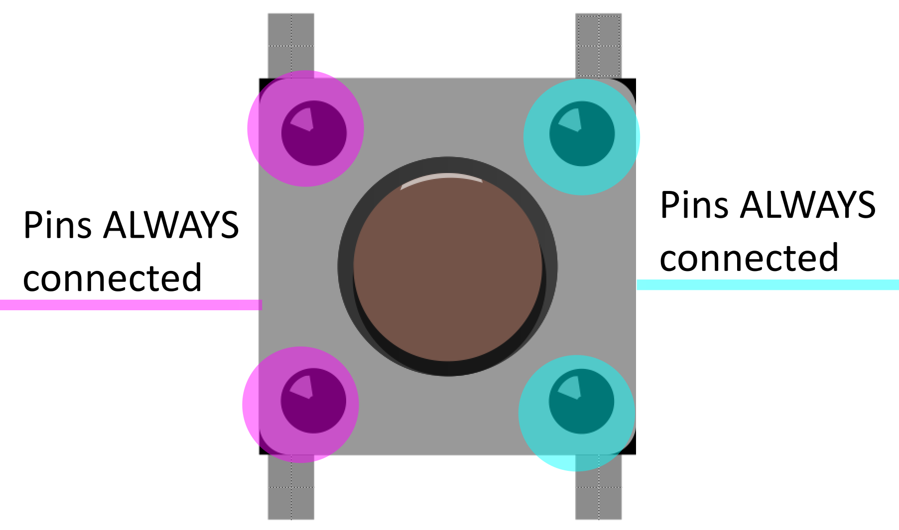
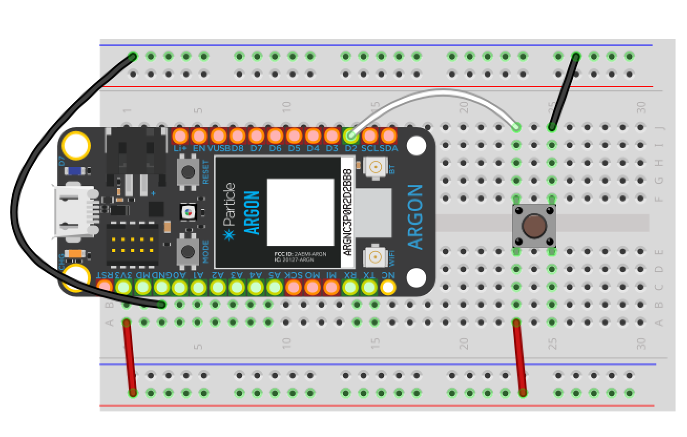
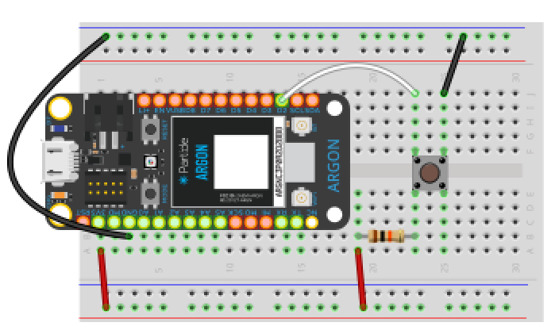

<!-- headingDivider: 2 -->

# Push Buttons

## Push Buttons

* Momentary switches that make (or break) electrical contact when pressed
* "Normally open" buttons complete a circuit when pressed *(this is what is in the kit)*
* "Normally closed" buttons break a circuit when pressed *(we won't use these in class)*

## Push Button Orientation

* Buttons have four pins and designed to go across the center of the breadboard
 

## Push Button Connections (Normally Open)

* In the picture, each set of pins "vertically across" from each other are **always** connected
* Each set of pins "horizontally next to" each other are **not connected** until the button is presed 

## Goal

* We want to use the button to send a binary (on/off) signal
* Since this is a digital input, we can use HIGH (3.3v) and gnd

## First Version

## First Version - Problem

* When button is pressed, it is connected to gnd (LOW)
* When button is open, is it LOW or HIGH?

## Floating Input

* When an digital input is neither exactly LOW (0v) or HIGH (3.3v), we say it is **floating**
* This means it is somewhere between 0-3.3v
* Should 2.4v be LOW or HIGH?
* Let's fix this

## Second Version

## Second Version Problem

* When button is open, we have HIGH (fixed)
* When button is pressed, we connect power (3.3v) to gnd (**BAD!**)

## Final Version

## Final Version - With Pull-Up Resistors

* We use a large resistor (10KOhms) to "pull-up" the input to 3.3v when the button is open (HIGH)
* When the button is pressed, the input goes to gnd (LOW), and we no longer have short-circuit from power to ground
* When button is pressed, we connect power (3.3v) to gnd (**BAD!**)

## IMPORTANT

* **ALWAYS USE A PULL-UP RESISTOR WITH BUTTONS**
* Otherwise you can damage the Argon permanently
## Try it out

## Credit

- [Sparkfun](https://learn.sparkfun.com/tutorials/switch-basics/momentary-switches)
- [SVG]()
