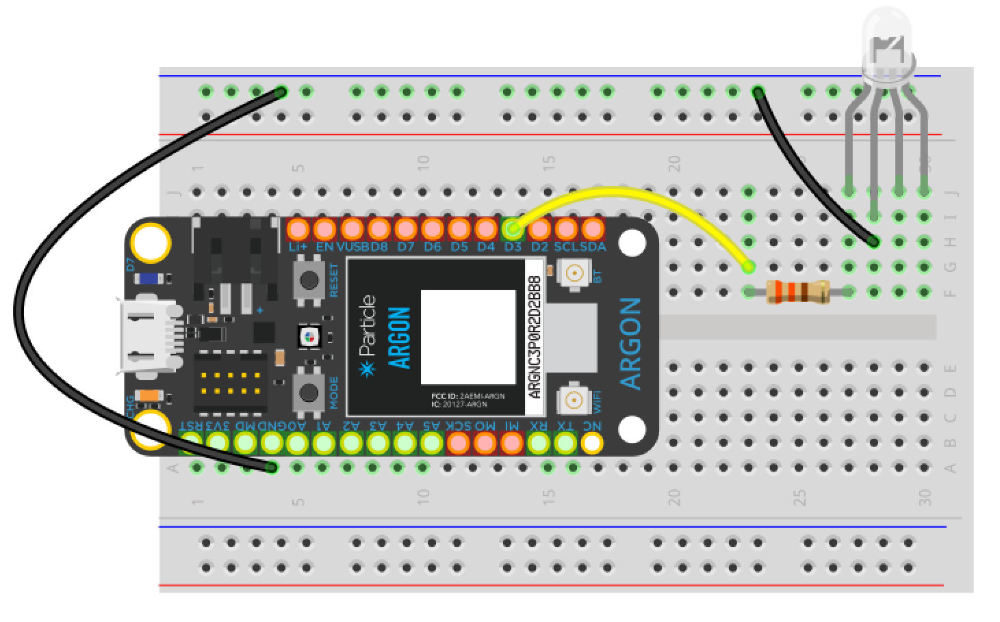

<!-- headingDivider: 2 -->

# RGB LEDs

## Three LEDs in One!

- RGB LEDs combine three separate LEDs in one package
  - Red LED
  - Green LED
  - Blue LED
- These **primary colors** can be controlled separately to create a multitude of color possibilities

## Pins

- RGB LEDs have four pins
- Three pins to each of R, G, B *(shorter pins)*
- One pin serves as either common anode or common cathode *(longer pin)*

## Recall: Current Flow in LED

- LEDs allow current to flow **in only one direction**
- Positive voltage applied to the **anode**
- **Cathode** connected to Ground

## Current Flow in RGB LEDs 

- RGB LEDs operate in generall same way
- Current flows from anode to cathode
- Positive voltage on anode causes LED to turn on
- But there is a small catch to beware of...
  - There are two types of RGB LEDs

## Common Cathode Work Like Regular LEDs

- R, G, B pins are **anode** (*positive*)
- Connect **cathode** (longer pin) to **Ground** (*negative*)
- Output **HIGH** (3.3v) on anode turns on, LOW turns off

## Common Cathode Wiring

## Common Anode are the Opposite from Regular LEDs

- R, G, B pins are **cathode** (*negative*)
- Connect **anode** (longer pin) to 3.3v (*positive*)
- Output LOW on anode to turn on LED; output HIGH (3.3v) to turn off

## Common Anode Wiring

## Color Mixing

##### R + G + B = ?

## Color Mixing with RGB LEDs

- R + G + B **≠** W
- Due to variations in manufacturing and resistor tolerances

## Credit

- <a href="https://creativecommons.org/licenses/by-sa/3.0" title="Creative Commons Attribution-Share Alike 3.0">CC BY-SA 3.0</a>, <a href="https://commons.wikimedia.org/w/index.php?curid=755036">Source</a>
- [Sparkfun](https://learn.sparkfun.com/tutorials/pulse-width-modulation)

