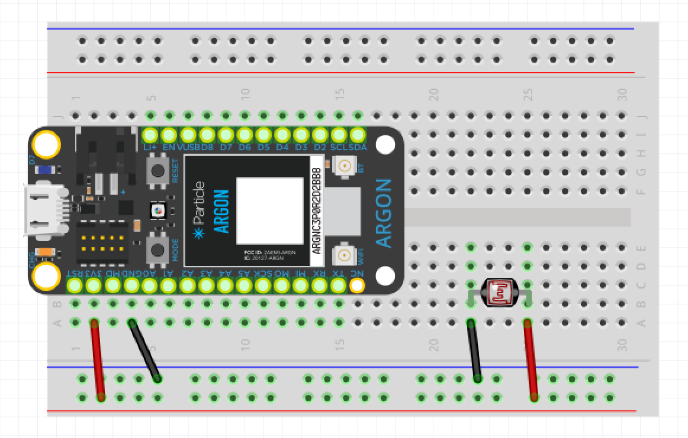
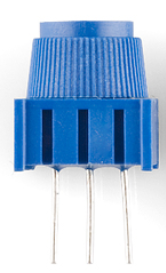

<!-- headingDivider: 2 -->

Name _________________________________________  Partner _________________________________________ 

# Photoresistor

## Experiential Learning: Calibrating a photoresistor 

Pre-reading:

[Kirchoff's Voltage Law](https://www.khanacademy.org/science/ap-physics-1/ap-circuits-topic/kirchhoffs-loop-rule-ap/v/ee-kirchhoffs-voltage-law)

### Part 1: Calibrating in Hardware

1. A photoresistor is device whose resistance varies with the amount of light present. Will we use analogRead or digitalRead? __

2. Consider the range of values the argon will read when using the photoresistor using this method

   1. What is the maximum value the argon will read?  __ <!-- 4095 -->
   2. What is the maximum value the argon will read?  __ <!-- 0 -->

   

3. Use multimeter to measure resistance of photoresistor outside of a circuit

   1. Resistance in ambient room light: __ <!-- 2k -->
   2. Resistance in bright light (cell phone light): __ <!-- 500 -->
   3. Resistance in darkness: __ <!-- 9k -->

4. Connect photoresistor to 3.3v and gnd. Use multimeter to measure voltage

   1. Voltage in ambient room light: __ <!-- 3.3v -->
   2. Voltage in bright light (cell phone light): __ <!-- 3.3v -->
   3. Voltage in darkness: __ <!-- 3.3v -->

5. What do you notice? __ <!-- The voltage is always the same-->

6. Why do you think this is? <!-- The resistance varies, but the voltage drop is always the same by KVL -->

   

7. Think back to using potentiometer. 
A potetiometer is also a variable resistor (like a photoresistor). With a potentiometer, we were able to measure voltage changes as we varied the resistance. What is different about using a photoresistor? __ <!-- The pot has three terminal which creates a voltage divider; there are two different "resistors" and we are measure the ratio of the two -->

8. Is there a way we could create a similar system in order to measure voltage changes with the photoresistor? __ <!-- use a fixed second resistor -->

### Part 2: Calibrating in Hardware

9. Connect a 10k potentiometer and photoresistor to your argon (see diagram; note: disconnect ground from potentiometer). Display the value from reading the photoresistor on the serial monitor. What is the range of values? __ <!-- 0 - 4095; note they will only use two terminals from pot -->
10. These input values correspond to what actual voltage levels? __ <!-- 0 - 3.3v -->
11. If our goal is to make allow the argon to be most sensitve to changes at ambient, visible light levels, how should we set our potentiometer? That is, if we want to maximize our ability to detect changes above or below ambient light, how should we set our potentiometer? __ <!-- the pot should be set to the same resistance as the photoresistor at ambient light -->
12. Based on your results in part 1, what value of resistance on the potentiometer do you think will give the middle value reading the input? __ <!-- should be same as resistance at ambient light -->
13. When the input reading of the photoresistor is at the middle of the ADC range, what would you expect the voltage to be? __
14. Set your potentiometer so the argon is reading the middle input value. Now turn off your circuit and measure the resistance in the potentiometer. How does this compare to your answers from part 1? __ 
15. Carefully replace the potentiometer in your circuit. Measure the voltage from the photoresistor to ground. __

### Part 3: Calibrating in Software
16. If you don't have the exact resistor or a potentiometer, there is a way to calibrate a photoresistor in software. Using a 1k resistor, use software to calibrate your photoresistor. Display on the serial monitor the input value and whether it is **dark**, **light**, or **ambient**

## Credit

- [Sparkfun](https://www.sparkfun.com/products/9088)
- [Sparkfun](https://www.sparkfun.com/products/9806)
