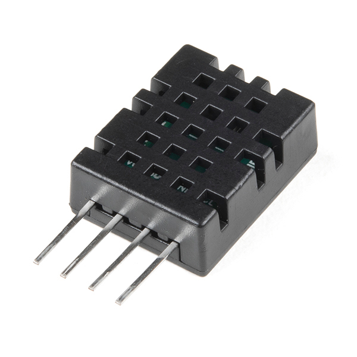
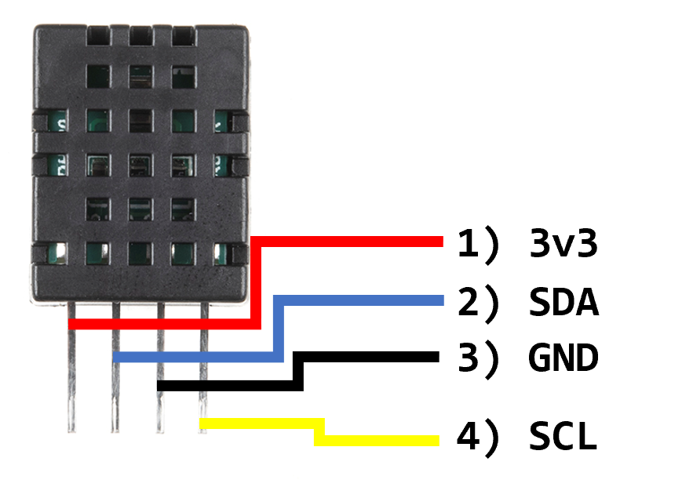

<!-- headingDivider: 2 -->

# DHT20 - Temperature and Humidity Sensor

  


## Sensor Type

**Important!** There are different styles of DHT sensors, and they need to be connected and programmed differently. Make sure to verify which sensor you have before proceding.

## Digital Temperature and Humidity Sensor

* DHT 20 measure temperature and relative humidity
* Unlike TMP36, this has a digital interface and no calculation or conversion is needed

## Wiring Guide - 4 Pins
 

1. 3.3V
2. SDA
3. Ground
4. SCL

## Wiring


Note: In Fritzing, if you don't find a DHT 20 (black), you can used the DHT 22 or DHT 11 in your diagram.

## Software Library

* The DHT20 uses a protocol called **I2C** to send data
* In order to communicate with the device, we will need to use a special library 
* The Argon-compatible library we will use is
  ```DHT_I2C_Particle```


## Library Setup

```c++
#include "DHT20.h"
```

```c++
DHT20 DHT;
```
## ```setup()```

```c++
//initialize DHT software object
dht.begin();
```

## Wait for Data and Error Checking

```c++
int status = dht.read();
if (status == DHT20_OK) {  // means this was valid read
	//proceed with processing sensor values
}
```

## Reading Values

```c++
// Read humidity
float h = dht.getHumidity();
// Read temperature as Celsius
float t = dht.getTemperature();
// Read temperature as Farenheit
float f = dht.getTemperatureF();
```


## Full Example

```c++
//
//    FILE: DHT20_simple.ino
//  AUTHOR: Rob Parke based on work by Rob Tillaart
// PURPOSE: Demo for DHT20 I2C humidity & temperature sensor
//

//  Always check datasheet - front view
//
//          +--------------+
//  VDD ----| 1            |
//  SDA ----| 2    DHT20   |
//  GND ----| 3            |
//  SCL ----| 4            |
//          +--------------+

#include "DHT20.h"

DHT20 dht;

void setup() {
    dht.begin();
    Serial.begin(9600);
    delay(1000);
}

void loop() {
    int status = dht.read();

    if (status == DHT20_OK) {  // valid read
        Serial.print("DHT20 \t");
        Serial.print("% Humidity: " + String(dht.getHumidity()));
        Serial.print("\t");
        Serial.print(String(dht.getTemperature()) + " C");
        Serial.print("\t");
        Serial.println(String(dht.getTemperatureF()) + " F");
    } else {
        Serial.println("Invalid read");
    }

    delay(1000);
}
```

## Notes

* Always wait about 2.5 seconds in between measurements (use `millis` preferably for this instead of `delay`)

## Credit

* [Sparkfun](https://www.sparkfun.com/products/10167)
* Diagrams created with [Frizting](https://fritzing.org)


