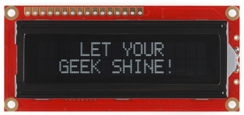
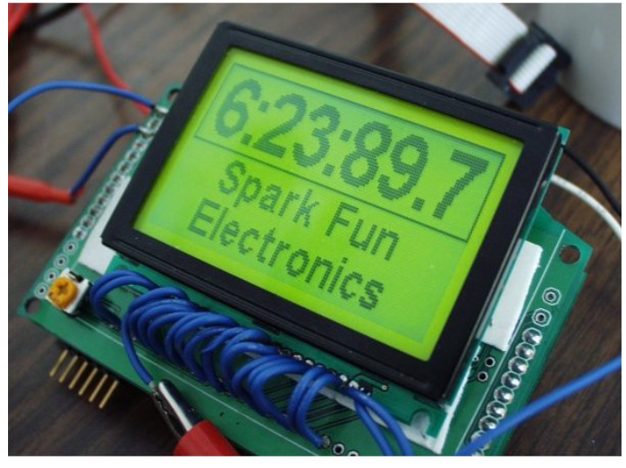
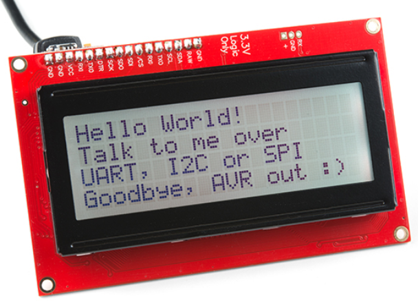
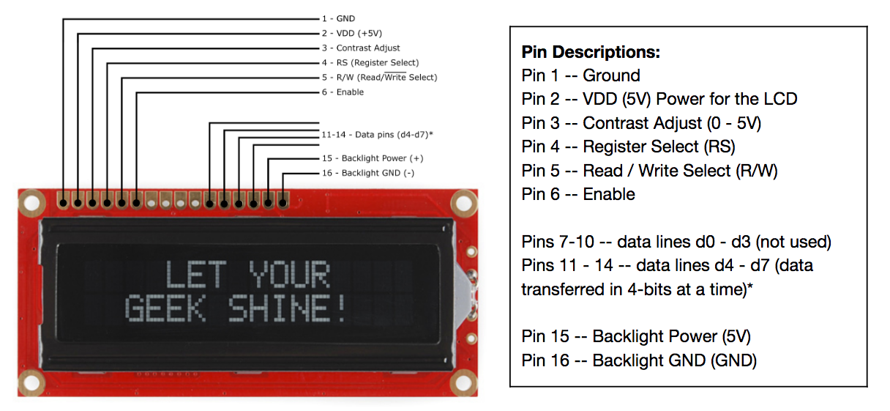
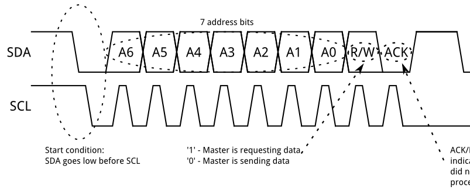

<!-- headingDivider: 2 -->

<!--recommend using M-F wires (each student will need 4 short wires) -->

# I2C LCDs

## LCDS Output Screens
* Let's introduce the humble LCD

  

## Liquid Crystal Display (LCD)



## LCDs

* Output device that display text in rows and columns
* Can be use for simple graphics, but primarily for text
* Relatively cheap
* Passive, low power

## LCD Pixels


## LCD Come in Many Different Sizes and Colors







## Basic wiring



## Basic Wiring

* The standard wiring of an LCD uses 16 wires (requiring 12 pins on the Argon)!
* The condensed wiring use 12 wires (requiring 8 pins on the Argon)!
* Writing code to communicate with the LCD is challenging (more on that later)

## Basic wiring Condensed


## Basic wiring Condensed
* 4 pins for power (2 for LCD, 2 for backlight
* 4 pins for controlling LCD 
* 8 (or 4) pins for data (the text you want to display)

## Parallel LCD

* There are 8 pins for data when operating **in parallel**
* Let's say you want to display the letter **Q**

* The letter **Q** is represented on a computer by the binary string
  `01010001`

* Each bit will be transmitted on a separate data pin

## Serial LCD

* Thankfully there is a better solution!
* What is a serial communication?
* What serial protocols have used so far? 
  <!-- SPI for OLED, 1Wire for DHT22 -->

## What is Synchronous Communication?

* Data pin and clock pin

* Clock is an oscillating square wave
* On rising (low to high) or falling (high to low) edge, the receiver samples ("read") data line 

## Serial, Synchronous Communication


## I2C

* Inter-integrated Circuit  (I2C) is a protocol to allow a central device to communicate with multiple "peripheral" chips
* Serial
* Synchronous
* Only two pins
  * Data (```SDA```)
  * Clock (```SCK```)

## I2C Transmission


## I2C Transmission - Part 1 Address



## I2C Transmission - Part 2 Data


## I2C Addresses

* Since multiple devices might be connected on the same two wires, many devices are "listening" to the communication
* Each device is given a 7-bit address to distinguish it from anyone devices
  * 0000000 - 1111111 (binary)
  * 0 - 127 (decimal)
  * 0x0 - 0x7F (hexadecimal)
* These addresses are often fixed and specified on the hardware device

## I2C vs SPI


| I2C                  | SPI                                              |
| -------------------- | ------------------------------------------------ |
| Uses 2 wires         | Uses 4 wires; more devices means even more wires |
| Uses more power      | Uses less power                                  |
| Lower transfer speed | Higher transfer speed                            |
| Standardized         | Multiple "versions"                              |

## I2C Serial Backpack


## I2C Serial Backpack

* A "backpack" is a component that is added on another device
* The I2C backpack (black-colored logic board) translates the 8 pin parallel communication to 2 pin serial communication
* The blue potentiometer can be used to adjust the contrast
* Jumper on the left acts like a removeable switch to control LED backlight

## Serial I2C LCD Wiring

| LCD  | Argon | Function  | Notes      |
| ---- | ----- | --------- | ---------- |
| GND  | GND   | Ground    | Ground     |
| VCC  | VUSB  | Power     | must be 5v |
| SDA  | SDA   | data line |            |
| SCK  | SCK   | clock     |            |

## Special Notes

* **SDA** and **SCL** lines need pullup resistors (4.7k or 10k) to **3V3** (not VUSB)
  * [Particle documentation reference](https://docs.particle.io/support/particle-devices-faq/i2c-faq/#it-requires-pull-up-resistors)
* VCC on LCD goes to VUSB (otherwise it will be very light and hard to read)

## Exercise 1

* Download project: Go to [https://bit.ly/ProjectZip](https://bit.ly/ProjectZip)
* Paste the following link into the top right
  https://github.com/reparke/ITP348-Physical-Computing/tree/main/_exercises/week13/ultrasonic_start
* Connect I2C LCD and run example code
* Recommended library for Argon
  * ```LiquidCrystal_I2C_Spark```

## Exercise 2

* Connect ultrasonic range finder and displace distance to object on LCD
  * Trigger: D3
  * Echo: D4
* Use RGB LED to alarm: green for n

## Credit

- [Sparkfun](https://learn.sparkfun.com/tutorials/basic-character-lcd-hookup-guide/all)
- [Sparkfun](https://www.sparkfun.com/categories/76)
- [Sparkfun](https://learn.sparkfun.com/tutorials/i2c/all#why-use-i2c)

