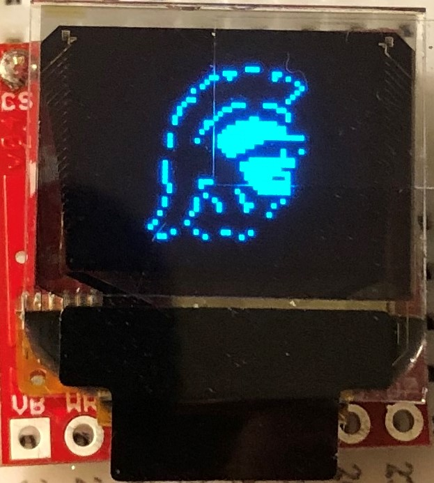
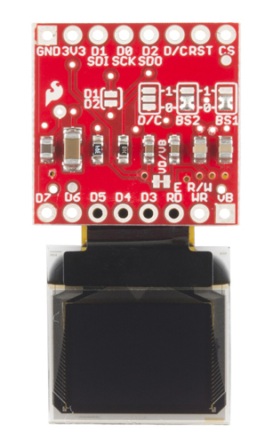
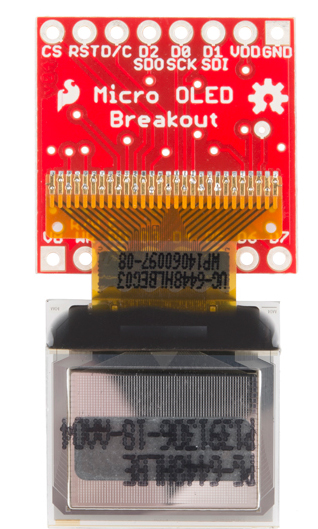
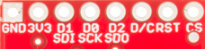
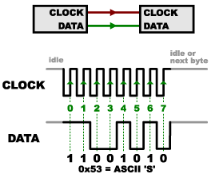
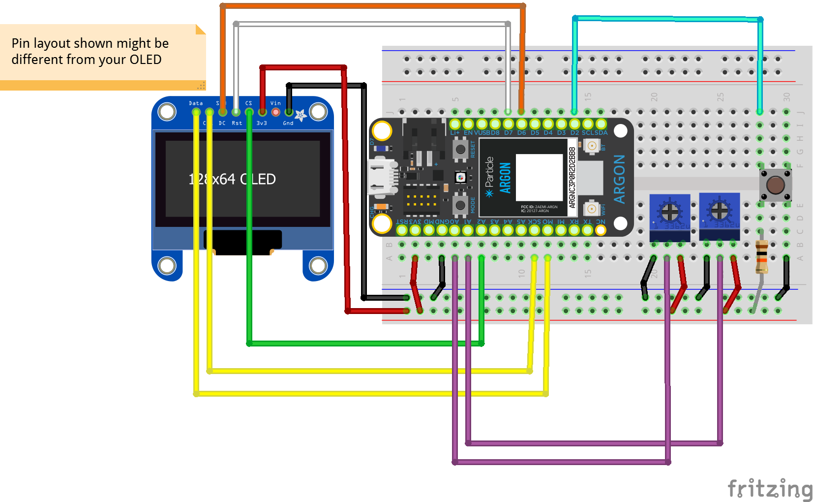

<!-- headingDivider: 2 -->

<!-- reference for library api
https://learn.sparkfun.com/tutorials/micro-oled-breakout-hookup-guide#using-the-arduino-library -->

# OLED Screens and SPI Communication

## Note: Old Version with SPI

- The following describes the SPI version of the OLED screen
- This OLED is no longer used in our class 
- Please see the I2C version of the OLED screen

### ITP 348 - Introduction to Physical Computing

## Learning Objectives
* Explain what synchronous, serial communication means
* Understand key concepts behind SPI protocol
* Identify OLED configuration parameters by reading through datasheet and software library 
* Implement OLED screen in a device

## Improving Output
* Serial monitor is fine for debugging, but we need better output to build a device

* Let's introduce one output device

  
  
  ## Introducing Organic Light-Emitting Diodes

## OLEDs

* OLEDs are more complex than regular LEDs and be manufactured to be thin and bendable
* OLEDs are used in high end TVs, monitors, and phones
* OLEDs are more expensive than regular LEDs

## Our Micro OLED has two components

## OLED screen

* Blue text on black screen
* 64 pixels (H) x 48 pixels (W)
* Operates at 3.3v
* Controlled via I2C or SPI protocol *(more on this later)*
* 31 pins (!) 

## Breakout Board

* Custom circuit board that provides access to ("breaks out") the **very delicate** small pins on the screen
* This breakout board allows us to connect up to 16 pins, but we only need to worry about the top 8 pins

## Breakout Board Pins

## 

| OLED | SPI Function | Notes                                                        |
| --------- | ------------ | ------------------------------------------------------------ |
| GND       | Ground       | Ground                                                       |
| 3V3       | Power        | 3.3v                                                         |
| D1 (SDI)  | MOSI         | Serial data in                                               |
| D0 (SCK)  | SCK          | SPI clock                                                    |
| D2 (SDO)  | MISO         | Unused                                                       |
| D/C       | Data / Command | Specify incoming byte as command or screen data |
| RST       | Reset        | Active-low reset (3.3v to enable)          |
| CS        | CS           | SPI chip select (active-low)                                 |

## Communication

* Communicating with the screen directly is complicated but we can use a library to simplify 
  * This is similar to installing software on your computer to communicate with your printer (*software driver*)
* Argon can communicate with the screen using two different protocols: **SPI** or **I2C**
* *We will discuss **I2C** later in the course*

## What is Synchronous Communication?

## Synchronous Communication

* Clock pin and data pin(s)
* Clock is an oscillating square wave
* Receiver reads **data** signal on **clock** rising edge *(low to high)* 
* **Synchronous:** data sent on regular intervals controlled by a clock
* **Serial:** one bit at time is sent / received

## What is Serial Peripheral Interface (SPI)?

* SPI is one implementation of **serial synchronous** communication to send and receive data between devices
* **Synchronous:** data is sent on regular intervals controlled by a clock
* **Serial:** one bit at time is sent / received 
* Terminology:
  * Argon will be called **main**
  * OLED (peripheral) will be called **secondary**

## SPI Structure

## SPI Structure

* Two data pins for bidirectional communication (one for sending data, one for receiving)
* Data <u>from</u> Argon (**M**ain **O**ut) <u>to</u> OLED (**S**econdary **I**n) is the **MOSI** pin
* Data <u>to</u> Argon (**M**ain **I**n) <u>from</u> OLED (**S**econdary **O**ut) is the **MISO** pin

## Additional Pins 

* SPI also includes a **CS** (**chip select**) pin, which is used to specify which secondary device is active
  * e.g. if you were controlling multiple OLED screens
* OLED screen includes a **D/C** pin to distiguish between **commands** (e.g. clear screen) and **data** (e.g. display byte `01001011`)

## Argon - OLED Screen Pin Mapping
*see next slide*
## 

| OLED | Argon    | SPI Function | Notes                                                        |
| --------- | ------------ | ------------ | ------------------------------------------------------------ |
| GND       | GND          | Ground       | Ground                                                       |
| 3V3       | 3V3          | Power        | 3.3v                                                         |
| D1 (SDI)  | MO           | MOSI         | Serial data in                                               |
| D0 (SCK)  | SCK          | SCK          | SPI clock                                                    |
| D2 (SDO)  | -            | MISO         | Unused                                                       |
| D/C       | Digital Pin | Data / Command | Specify incoming byte as command or screen data |
| RST       | Digital Pin | Reset        | Active-low reset (3.3v to enable)          |
| CS        | Digital Pin | CS           | SPI chip select (active-low)                                 |

## OLED Library

* We need a library to handle much of the complex communication with the OLED 
* To install a library, go to the command palette and type `Install Library`
* Install the OLED library: `SparkFunMicroOLED`

## Lab

* Connect OLED and install library
  * Use: `D/C (pin D6)`, `RST (pin D7)`, `CS (pin A2)`
* Run sample code; Modify sample code to display `Hello world!`
* Finally, create an [Etch A Sketch](https://www.youtube.com/watch?v=vVA9wdiIlN4) using the OLED screen with two potentiometers (to draw) and one button (to reset)
* [Library code](https://github.com/sparkfun/Micro_OLED_Breakout/tree/V_1.0)
* [Library guide](https://learn.sparkfun.com/tutorials/micro-oled-breakout-hookup-guide#using-the-arduino-library)
* [Datasheet](https://cdn.sparkfun.com/assets/learn_tutorials/3/0/8/SSD1306.pdf)

## Lab - Etch-a-Sketch

## Credit

- Photo by [Sparkfun](https://learn.sparkfun.com/tutorials/micro-oled-breakout-hookup-guide)
- Photo by  [Sparkfun](https://learn.sparkfun.com/tutorials/serial-peripheral-interface-spi/all)
- Images created with [Fritzing](https://fritzing.org/home/)
- Photo by [Mika Baumeister](https://unsplash.com/@mbaumi?utm_source=unsplash&utm_medium=referral&utm_content=creditCopyText) on [Unsplash](https://unsplash.com/?utm_source=unsplash&utm_medium=referral&utm_content=creditCopyText)

