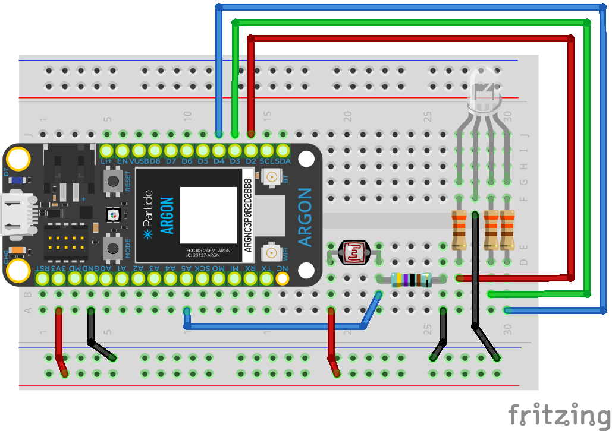

## Week {{page.week}}

* **Monday**
  * Watch Photoresistors
    
  * Watch Cloud Overview
    
  * Build

* **Wednesday**
  * Build 

* Optional
  * Watch [Kirchoff's Voltage Law](https://www.khanacademy.org/science/ap-physics-1/ap-circuits-topic/kirchhoffs-loop-rule-ap/v/ee-kirchhoffs-voltage-law)