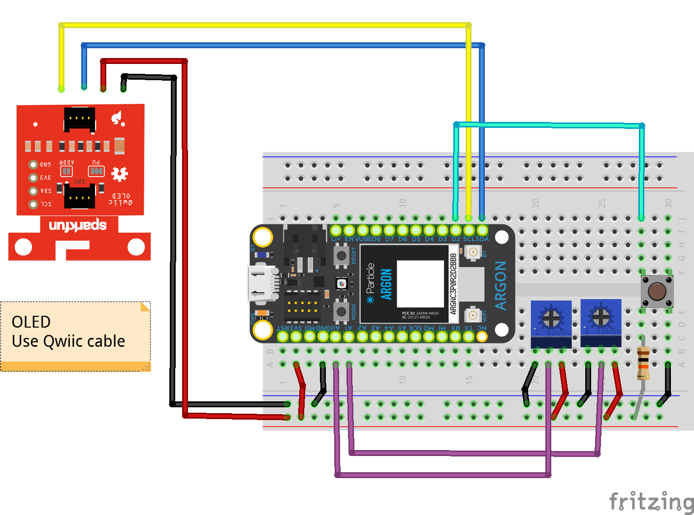
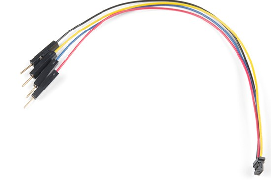

## Week {{page.week}}

### Watch before class Mon / Tues

* Analog Temperature Sensor
  

### Watch before class Wed / Thurs

* OLED Screens
  

### Bring to class all this week

- Argon, breadboard, resistors, push buttons, LEDs, RGB LEDS, wires potentiometer
- TMP 36 (analog temperature sensor)
- OLED screen
- *You can see what parts look like visually by checking out the [kit page](https://reparke.github.io/ITP348-Physical-Computing/kit)*

### Build before class Mon / Tues 

- none

### Build before class Wed / Thurs 

*Note: if you don't have room for both potentiometers and the button, you can leave off the button*

Use [Qwiic cable](https://www.sparkfun.com/products/14425) to connect OLED to Argon

| OLED | Argon    |
| --------- | ------------ |
| Black GND | GND          |
| Red 3V3   | 3V3          |
| Blue SDA | SDA        |
| Yellow SCL | SCL       |

### Optional

* OLED Library. We will go through through this process during class, but the video is useful if you ever need to refer back to it.
  

