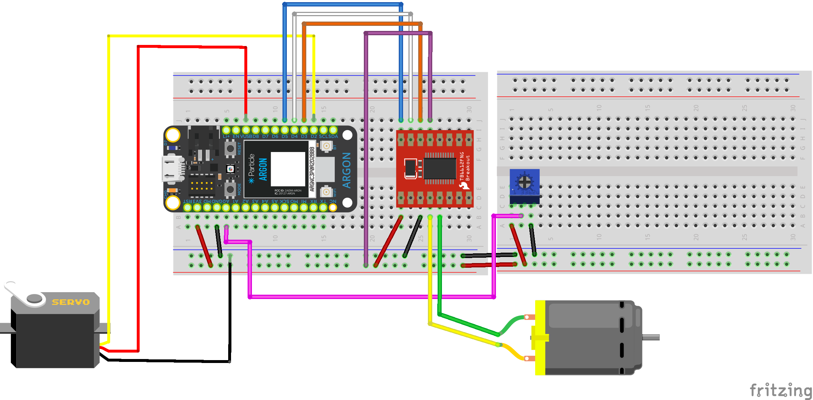

## Week {{page.week}}

### Sound

  

### Components Needed in Class 

- [Speaker / buzzer](https://www.sparkfun.com/products/7950)
- [Motor driver breakout board](https://www.sparkfun.com/products/14451)
- [DC motor](https://www.sparkfun.com/products/13302) (x2)
- [Servo motor](https://www.amazon.com/Smraza-Helicopter-Airplane-Control-Arduino/dp/B07L2SF3R4) (x2)
- [Fan for motor](https://www.amazon.com/EUDAX-Propeller-Airplane-Science-Education/dp/B073XM12MY)
- [Extension wires](https://www.sparkfun.com/products/9140)
- Potentiometer
- Bottle of water or tall cylinder (optional)
- Tape or string (optional)

*You can see what parts look like visually by checking out the [kit page](https://reparke.github.io/ITP348-Physical-Computing/kit)*

### Wiring for Tues

### Wiring for Thurs

The goal is to build a rotating fan. Here is the circuit wiring, and photos are below 

#### Wiring for Motor Controller

| Motor Controller | Argon | DC Motor            |
| ---------------- | ----- | ------------------- |
| PWMA             | D5    | -                   |
| AI2              | D4    | -                   |
| AI1              | D3    | -                   |
| AO1              | -     | Motor wire (either) |
| AO2              | -     | Motor wire (either) |
| VCC              | 3v3   | -                   |
| GND              | GND   | -                   |
| VM               | 3v3   | -                   |
| STBY             | 3v3   | -                   |

#### Wiring for Potentiometer

- 3.3v
- `A0`
- GND

#### Wiring for Servo

* The wiring colors vary with different servos so look carefully at your documentation
* Many servos will require **5V** not **3.3V** so use `VUSB` 

#### Photos

### Motors Reference

- [https://www.electronicproducts.com/Electromechanical_Components/Motors_and_Controllers/Motor_control_design_an_introduction_to_motors_and_controllers.aspx](https://www.electronicproducts.com/Electromechanical_Components/Motors_and_Controllers/Motor_control_design_an_introduction_to_motors_and_controllers.aspx)

