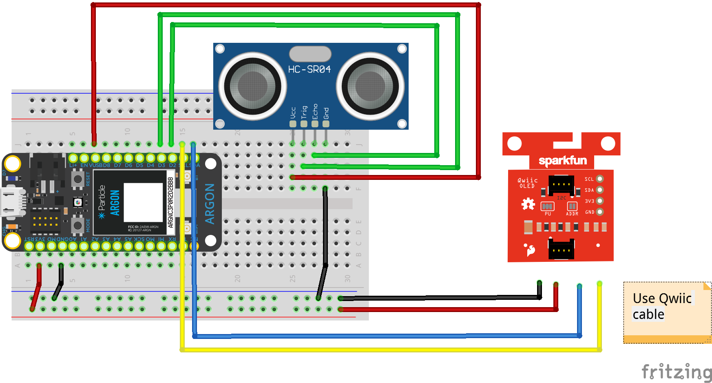

## Week {{page.week}}

* Watch **Ultrasonic Distance Sensor**
  

* Watch **OLED Graphics**
  

* Build for **Tuesday**

  

## Sensor Wiring

| Sensor | Argon |
| ------ | ----- |
| GND    | GND   |
| VCC    | VUSB  |
| TRIG   | D2    |
| ECHO   | D3    |

| OLED         | Argon |
| ------------ | ----- |
| GND          | GND   |
| 3V3          | 3V3   |
| SDA (Blue)   | SDA   |
| SCL (Yellow) | SCL   |

