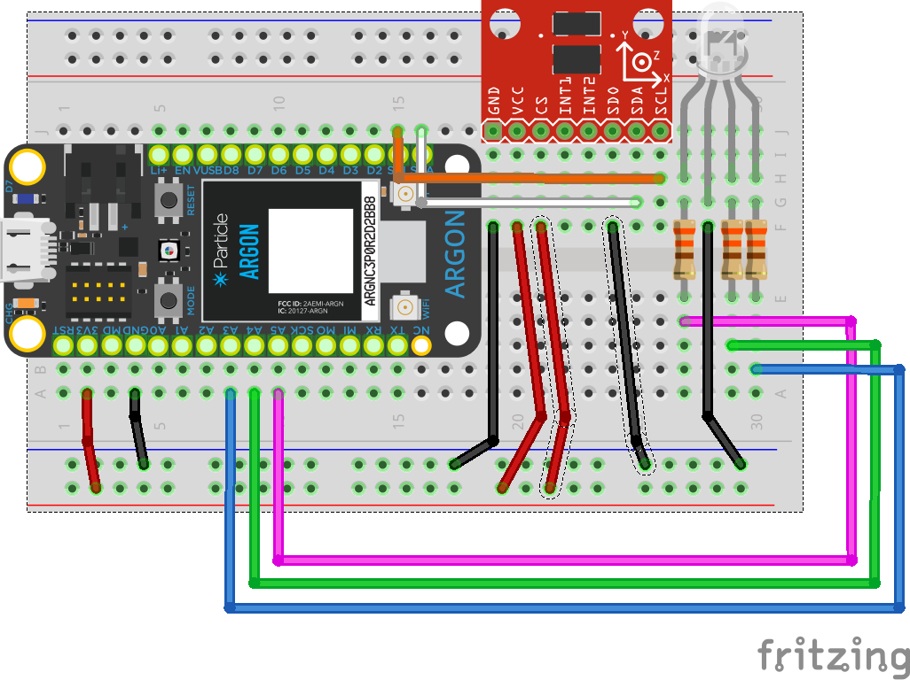

## Week {{page.week}}

### Watch before class this week

* Accelerometer
  

### Bring to class all this week

- Smart watch
- Argon, breadboard, resistors, push buttons, LEDs, RGB LEDS, wires potentiometer
- Accelerometer
- *You can see what parts look like visually by checking out the [kit page](https://reparke.github.io/ITP348-Physical-Computing/kit)*

### Build before class Wed / Thurs

- We will continue with the smart watch from last week

### Build before class Wed / Thurs 

| Sensor | Argon |
| ------ | ----- |
| GND    | GND   |
| VCC    | 3V3   |
| CS     | 3V3   |
| SDO    | GND   |
| SDA    | SDA   |
| SCL    | SCL   |

| RGB LED | Argon |
| ------ | ----- |
| R    | A5 |
| GND | GND |
| G    | A4 |
| B   | A3 |

