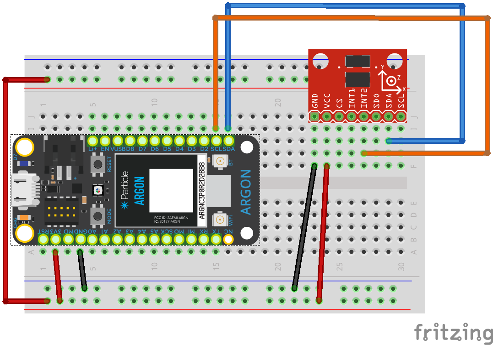

<!-- headingDivider: 2 -->

# Accelerometers


## Wiring

| Sensor | Argon | Function                        |
| ------ | ----- | ------------------------------- |
| GND    | GND   | Ground                          |
| VCC    | 3V3   | Power (requires 3.3v)           |
| SDA    | SDA   | I2C data (no resistors needed)  |
| SCL    | SCL   | I2C clock (no resistors needed) |

## Wiring Diagram



## Operation

### Library

* We need a library to handle much of the complex communication with the OLED 
* To install a library, go to the command palette and type `Install Library`
* Install the OLED library: `SparkFunMMA8452Q`

### Examples

- There are extensive examples in the library folder under `lib/examples`

## Code for Reading Acceleration Values

```c++
MMA8452Q accel;

void setup() {
    accel.begin(SCALE_2G,ODR_1);  // 2g and 1 Hz refresh
}

void loop() {
    if (accel.available()) {	//check if available
    accel.read();				//read sensor values
    float x = accel.cx;		//get X-dir measurement (in G's)  
    float y = accel.cy;		  
    float z = accel.cz;
    }
}
```


## Code for Detecting Orientation

```c++
MMA8452Q accel;

void setup() {
    accel.begin(SCALE_2G,ODR_1);  // 2g and 1 Hz refresh
}

void loop() {
  // accel.readPL() will return a byte containing information
  // about the orientation of the sensor. It will be either
  // PORTRAIT_U, PORTRAIT_D, LANDSCAPE_R, LANDSCAPE_L, or
  // LOCKOUT.
  byte pl = accel.readPL();
  switch (pl) {
    case PORTRAIT_U:
      changeRgbLight(0, 0, 255);
      break;
    case PORTRAIT_D:
      changeRgbLight(0, 255, 0);
      break;
    case LANDSCAPE_R:
      changeRgbLight(255, 0, 0);
      break;
    case LANDSCAPE_L:
      changeRgbLight(255, 0, 255);
      break;
    case LOCKOUT:
      changeRgbLight(255, 255, 255);
      break;
  }
}
```


## Code for Tap Detection

see [explanation](https://learn.sparkfun.com/tutorials/sparkfun-inventors-kit-for-photon-experiment-guide/experiment-8-activity-tracker)

```c++
byte threshold = 1;  // 2 * 0.063g = 0.063g (minimum threshold
byte pulseTimeLimit = 255;  // 0.625 * 255 = 159ms (max)
byte pulseLatency = 64;  // 1.25 * 64 = 640ms
MMA8452Q accel;

void setup() {
    accel.begin(SCALE_2G,ODR_1);  // 2g and 1 Hz refresh
    accel.setupTap(threshold, threshold, threshold, pulseTimeLimit,
                   pulseLatency);
}
void loop() {
    if (accel.available()) {
        accel.read();
    	if (accel.readTap() > 0) {
        	Serial.println("Tap!");
    	}
    }
}
```


## Credit

- [Sparkfun](https://www.sparkfun.com/products/13926)
- [Sensor Datasheet](https://cdn.sparkfun.com/datasheets/Sensors/Accelerometers/MMA8452Q-rev8.1.pdf)
- [Accelerometers, Gyros, IMUs](https://www.sparkfun.com/pages/accel_gyro_guide)
- Diagrams created with [Frizting](https://fritzing.org)

