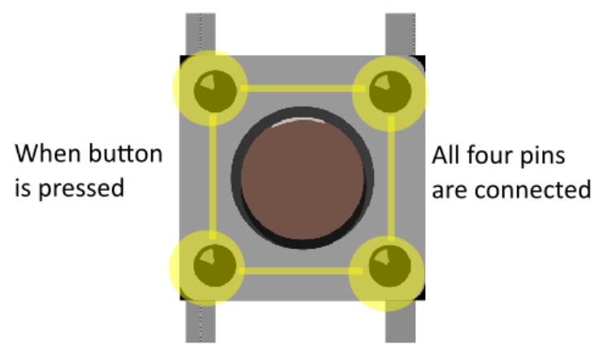

<!-- headingDivider: 2 -->

# Push Buttons


## Wiring


## Operation (Normally Open Button)

### Placement

 

### Unpressed / Open Circuit


* In the picture, each set of pins "vertically across" from each other are **always** connected (purple and blue)
* Each set of pins "horizontally next to" each other are **not connected** until the button is presed

### Pressed / Closed Circuit

* When button is pressed, all four pins are connected (yellow pins)



### Values

* Open / unpressed is `HIGH`
* Closed / pressed is `LOW`

## Code

```c++
const int PIN_BUTTON = D2;

void setup() {
   pinMode(PIN_BUTTON, INPUT);  //configure
   Serial.begin(9600);
}

void loop() {
	//read button state
   int buttonVal = digitalRead(PIN_BUTTON); 
   
    if (buttonVal == HIGH) {
     Serial.write("Button not pressed");
   }
   else {
     Serial.write("Button pressed");
   }
 }
```


## Credit

- [Sparkfun](https://learn.sparkfun.com/tutorials/switch-basics/momentary-switches)
- [SVG]()
- Images created with [Fritzing](https://fritzing.org/home/)
