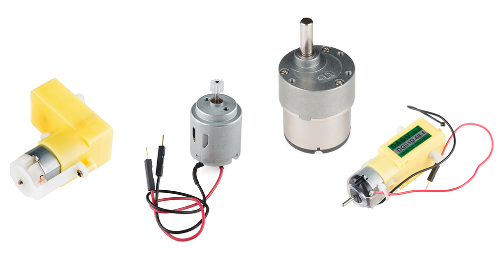
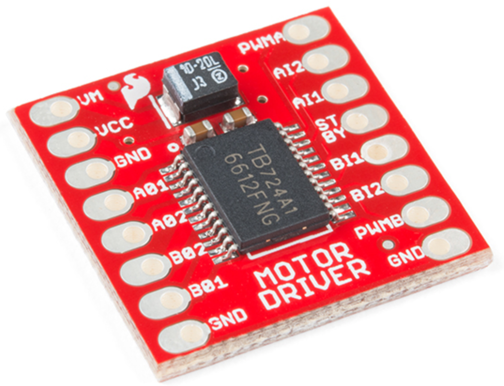

<!-- headingDivider: 2 -->

# DC Motors and Motor Driver





## Wiring Diagram for One Motor 


## Wiring Guide for One Motor


| Motor Controller | Photon 2                | DC Motor            |
| ---------------- | ----------------------- | ------------------- |
| PWMA             | A5 (any PWM pin works)  | -                   |
| AI2              | D4 (any GPIO pin works) | -                   |
| AI1              | D3 (any GPIO pin works) | -                   |
| AO1              | -                       | Motor wire (either) |
| AO2              | -                       | Motor wire (either) |
| VCC              | 3v3                     | -                   |
| GND              | GND                     | -                   |
| VM               | 3v3                     | -                   |
| STBY             | 3v3                     | -                   |

To connect a second DC motor, connect `PWMB`, `BI1`, and `BI1` to different Photon 2 pins in the same manner, and connect `BO1` and `BO2` to the wires on the second DC motor

## Reminder: Photon 2 PWM Pins

* Only certain pins support PWM
  * `D1` (`SCL` or `A4`)
  * `A2`
  * `A5`
  * `MISO` (`D16`)
  * `MOSI` (`D15`)


## Operation: Controlling the Motor Direction

* Setting the direction is done by changing the two input pins to HIGH and LOW separately
  * Ex: `AI1 = HIGH` and `AI2 = LOW` is one direction
  * Ex: `AI1 = LOW` and `AI2 = HIGH` is other direction
* Setting them both to `LOW` means stopping the motor
* Setting them both to `HIGH` can damage the motor

## Operation: Controlling the Motor Speed

* The PWM method of controlling motor speed operates on this range: **[0-255]**
* Typically the PWM must be somewhat greater than 0 before it starts to spin

## Code

```c++
const int AIN1 = D3;
const int AIN2 = D4;
const int PWMA = A5;

void setup() {
  pinMode(AIN1, OUTPUT);
  pinMode(AIN2, OUTPUT);
  pinMode(PWMA, OUTPUT);
}

void loop() {
  // set the direction one HIGH, one LOW
  digitalWrite(AIN1, HIGH);
  digitalWrite(AIN2, LOW);
  analogWrite(PWMA, 255);    // full speed one way
  delay(1000);             	 // run for 1 second

  analogWrite(PWMA, 0); 	 // stop
  delay(1000);				 // wait for 1 second

    
  // change direction by switching HIGH and LOW
  digitalWrite(AIN1, LOW);
  digitalWrite(AIN2, HIGH);
  analogWrite(PWMA, 255);    // full speed opposite way
  delay(1000);				 // run for 1 second

  analogWrite(PWMA, 0);      // stop
  delay(1000);               // wait for 1 sec
}

```


## Credits

* Images created with [Fritzing](https://fritzing.org/home/)
* [Sparkfun](https://www.sparkfun.com/products/14451)
* For more in-depth discussion of motors, see this [page](https://learn.sparkfun.com/tutorials/motors-and-selecting-the-right-one/all)