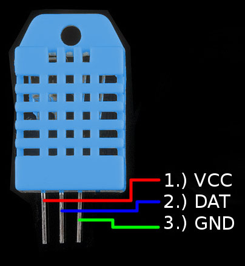

<!-- headingDivider: 2 -->

# DHT - Temperature and Humidity Sensor

  


## Sensor Type

**Important!** There are different styles of DHT sensors, and they need to be connected and programmed differently. Make sure to verify which sensor you have before proceeding.


## DHT 20


### Wiring Guide - DHT 20 -  4 Pins

 

1. 3.3V
2. SDA
3. Ground
4. SCL

### Wiring


Note: In Fritzing, if you don't find a DHT 20 (black), you can used the DHT 22 or DHT 11 in your diagram.


### Operation

- Always wait about 2.5 seconds in between measurements (use `millis` preferably for this instead of `delay`)

### Library

* We need a library to handle much of the complex communication with the OLED 
* To install a library, go to the command palette and type `Install Library`
* Install the OLED library: `DHT_I2C_Particle`

### Examples

- There are extensive examples in the library folder under `lib/examples`

### Code 

- The following code example will read the temperature and humidity at 2500 millisecond intervals

```c++
//
//    FILE: DHT20_simple.ino
//  AUTHOR: Rob Parke based on work by Rob Tillaart
// PURPOSE: Demo for DHT20 I2C humidity & temperature sensor
//

//  Always check datasheet - front view
//
//          +--------------+
//  VDD ----| 1            |
//  SDA ----| 2    DHT20   |
//  GND ----| 3            |
//  SCL ----| 4            |
//          +--------------+

#include "DHT20.h"

DHT20 dht;

void setup() {
    dht.begin();
    Serial.begin(9600);
    delay(1000);
}

void loop() {
    int status = dht.read();

    if (status == DHT20_OK) {  // valid read
        Serial.print("DHT20 \t");
        Serial.print("% Humidity: " + String(dht.getHumidity()));
        Serial.print("\t");
        Serial.print(String(dht.getTemperature()) + " C");
        Serial.print("\t");
        Serial.println(String(dht.getTemperatureF()) + " F");
    } else {
        Serial.println("Invalid read");
    }

    delay(1000);
}


```

## Notes

* Always wait about 2.5 seconds in between measurements (use `millis` preferably for this instead of `delay`)


## DHT 22 and DHT 11


## Wiring Guide - DHT 22 - 4 Pins

 

1. 3.3V
2. Digital input (needs 10k pull-up resistor)
3. No connection
4. Ground


## Wiring Guide - DHT 11 - 3 Pins

 

1. 3.3V
2. Digital input (needs 10k pull-up resistor)
3. Ground
## Wiring Guide - DHT 11 and DHT 22


Note: The wiring for the DHT 11 and DHT 22 is the same

### Operation

- Always wait about 2.5 seconds in between measurements (use `millis` preferably for this instead of `delay`)

### Library

* We need a library to handle much of the complex communication with the OLED 
* To install a library, go to the command palette and type `Install Library`
* Install the OLED library: `PietteTech_DHT`

### Examples

- There are extensive examples in the library folder under `lib/examples`

## Code 

- The following code example will read the temperature and humidity at 2500 millisecond intervals

```c++
#include "PietteTech_DHT.h"

#define DHTTYPE DHT11  // DHT model you have
#define DHTPIN D2      // DHT data pin

PietteTech_DHT dht(DHTPIN, DHTTYPE);

float h;
float c;
float f;

unsigned long prevMillis = 0;
unsigned long updateDelay = 2500;

void setup() {
  Serial.begin(9600);
  dht.begin();
}

void loop() {
    unsigned long currMillis = millis();
    if (currMillis - prevMillis > updateDelay) {
        prevMillis = currMillis;
		
		int result =
			dht.acquireAndWait(1000);  // wait up to 1 sec 
		if (result == DHTLIB_OK) {
		  h = dht.getHumidity();
		  c = dht.getCelsius();
		  f = dht.getFahrenheit();
		  Serial.println("Humidity: " + String(h, 1) + " %");
		  Serial.println("Temp (F): " + String(f, 1) + " deg F");
		  Serial.println("Temp (C): " + String(c, 1) + " deg C");
		} else {
		  Serial.println("Invalid reading");
		}
	}
}


```


## Credit

* [Sparkfun](https://www.sparkfun.com/products/10167)
* Diagrams created with [Frizting](https://fritzing.org)


