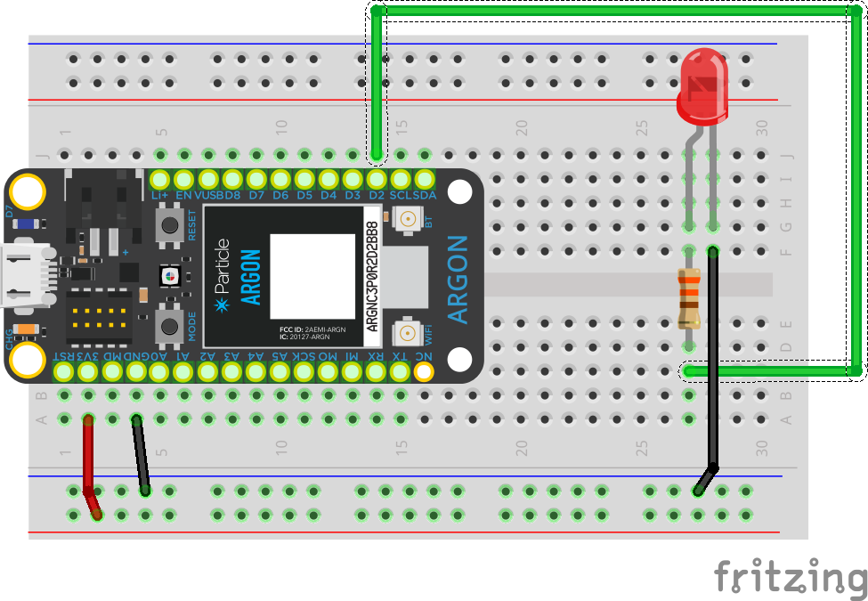

<!-- headingDivider: 2 -->

# LEDs - Light Emitting Diodes


## Wiring



* Anode (longer leg) connects to resistor and Argon
* Cathode (shorter leg) connects to `GND`


## Operation

* `HIGH` output turns LED on
* `LOW` output turns LED off


## Code

```c++
const int PIN_LED = D2;   //pin D2

void setup() {
  //initialize the pin mode
  pinMode(PIN_LED, OUTPUT);
}

void loop() { 
  digitalWrite(PIN_LED, HIGH); //turn LED on
  delay(100);				   //delay 100 ms
  digitalWrite(PIN_LED, LOW);  //turn LED off
  delay(100);		         //delay 100 ms
}
```


## Credits

* <a href="//commons.wikimedia.org/wiki/User:Afrank99" title="User:Afrank99">Afrank99</a> - <span class="int-own-work" lang="en">Own work</span>, <a href="https://creativecommons.org/licenses/by-sa/2.0" title="Creative Commons Attribution-Share Alike 2.0">CC BY-SA 2.0</a>, <a href="https://commons.wikimedia.org/w/index.php?curid=248198">Link</a>
* <a href="https://creativecommons.org/licenses/by-sa/3.0" title="Creative Commons Attribution-Share Alike 3.0">CC BY-SA 3.0</a>, <a href="https://commons.wikimedia.org/w/index.php?curid=755036">Link</a>
* Images created with [Fritzing](https://fritzing.org/home/)

