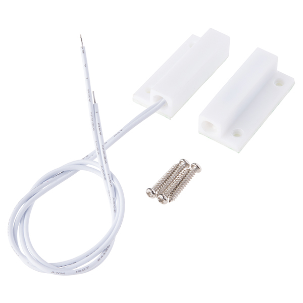

<!-- headingDivider: 2 -->

# Magnetic Switch



## Wiring


## Operation

* Switch is "normally open" (open circuit) - `HIGH`
* Switch is closed when placed near a magnet - `LOW`

## Code

````c++
const int PIN_SWITCH = D2;

void setup() {
   pinMode(PIN_SWITCH, INPUT);  //configure
   Serial.begin(9600);
}

void loop() {
	//read button state
   int switchVal = digitalRead(PIN_SWITCH); 
   
    if (switchVal == HIGH) {
     Serial.write("Switch open");
   }
   else {
     Serial.write("Switch closed");
   }
 }
````


## Credit

- André Karwath ([image](https://en.wikipedia.org/wiki/Reed_switch#/media/File:Reed_switch_(aka).jpg), [license](https://creativecommons.org/licenses/by-sa/2.5/deed.en))
- [Sparkfun](https://www.sparkfun.com/products/13247)
- Images created with [Fritzing](https://fritzing.org/home/)


