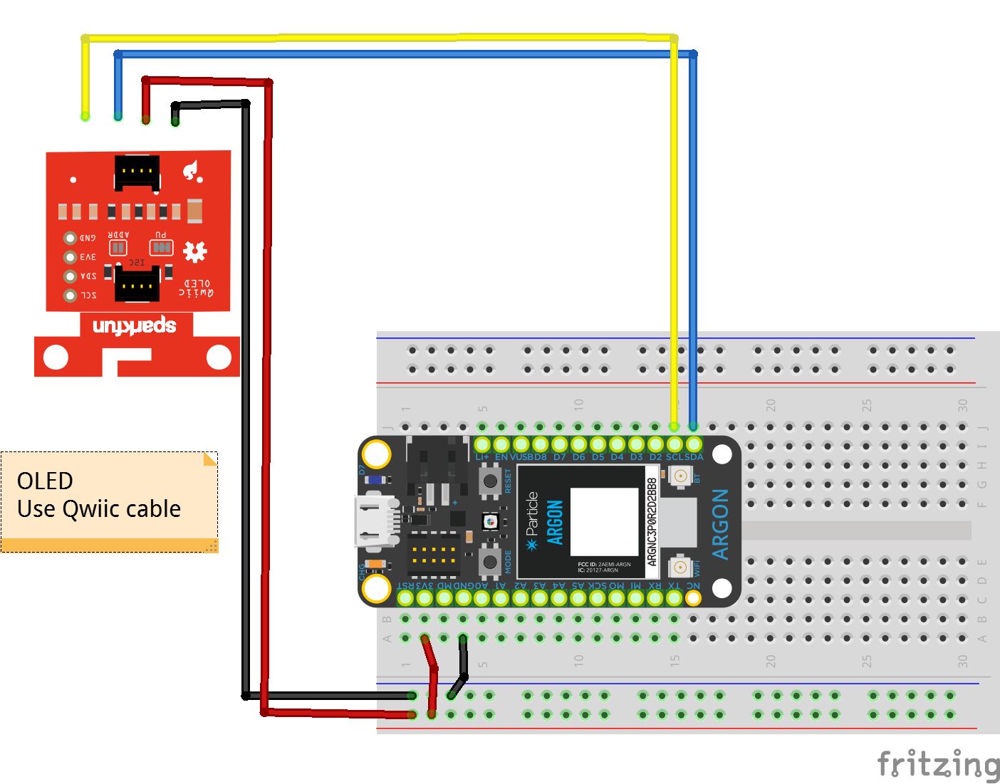

<!-- headingDivider: 2 -->


# MicroOLED (I2C)


## Wiring



## Wiring - Qwiic Cable


## 
<span style="font-size:75%">


| OLED         | Argon | Purpose | Notes                 |
| ------------ | ----- | ------- | --------------------- |
| GND          | GND   | Ground  | Ground                |
| 3V3          | 3V3   | Power   | 3.3v                  |
| SDA (Blue)   | SDA   | Data    | Serial data           |
| SCL (Yellow) | SCL   | Clock   | Synchronization clock |

</span>

## Operation

### Library

* We need a library to handle much of the complex communication with the OLED 
* To install a library, go to the command palette and type `Install Library`
* Install the OLED library: `SparkFunMicroOLED`

### Examples

- There are extensive examples in the library folder under `lib/examples`

## Code

- Below is a basic example which displays the following on the screen

```html
Hello World
There are 7 days in a week
```


```c++
#include "SparkFunMicroOLED.h"  // Include MicroOLED library

//////////////////////////////////
// MicroOLED Object Declaration //
//////////////////////////////////

// RESET is hardwired so use any pin that is unused
#define PIN_RESET D9

// The DC_JUMPER is the I2C Address Select jumper. Set to 1 if the jumper is
// open (Default), or set to 0 if it's closed.
#define DC_JUMPER 1

MicroOLED oled(MODE_I2C, PIN_RESET, DC_JUMPER);  // create object to communicate with OLED

void setup() {
    oled.begin();     // Initialize the OLED
    oled.clear(ALL);  // Clear the display's internal memory
    oled.display();   // Display what's in the buffer (splashscreen) 
    delay(1000);      // Delay 1000 ms
    oled.clear(PAGE); // clear screen
}

void loop() {
	//set (x,y) location; (0,0) is top left
    oled.setCursor(0,0);
    
	//set font size
	oled.setFontType(0);
	
	//Display message
    oled.println("Hello World");
	
	//Display string and int
	int days = 7;
	oled.println("There are " + String(days) + " days in a week")

	// actually show the printed lines on the screen
    oled.display();
	
	// clear the screen
    oled.clear(PAGE);

}

```

## Reference

* [Library code](https://github.com/sparkfun/Micro_OLED_Breakout/tree/V_1.0)
* [Library guide](https://learn.sparkfun.com/tutorials/micro-oled-breakout-hookup-guide#using-the-arduino-library)
* [Datasheet](https://cdn.sparkfun.com/assets/learn_tutorials/3/0/8/SSD1306.pdf)

## Credit

- Photo by [Sparkfun](https://learn.sparkfun.com/tutorials/qwiic-micro-oled-hookup-guide)
- Photo by  [Sparkfun](https://www.sparkfun.com/products/14532)
- Images created with [Fritzing](https://fritzing.org/home/)
- Photo by [Mika Baumeister](https://unsplash.com/@mbaumi?utm_source=unsplash&utm_medium=referral&utm_content=creditCopyText) on [Unsplash](https://unsplash.com/?utm_source=unsplash&utm_medium=referral&utm_content=creditCopyText)

