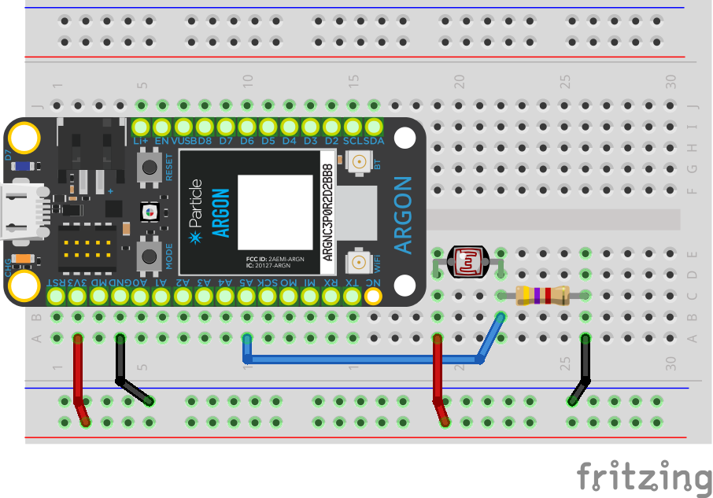

<!-- headingDivider: 2 -->

# Photoresistors


## Wiring

- Requires analog input pin (Pins `A0`-`A5`)



## Operation

* As light level varies, Argon will measure a voltage change on analog input (due to voltage divider)
* Since this is an analog input, we use **analog to digital conversion** to read input
* Voltage on pin will varies 0v to 3.v, and Argon will read 0 to 4095 

## Code

```c++
const int PIN_PHOTORESISTOR = A5;

void setup() {
    Serial.begin(9600);
    pinMode(PIN_PHOTORESISTOR, INPUT);
}

void loop() {
	// read analog value (ADC); range 0-4095
    int lightReading = analogRead(PIN_PHOTORESISTOR);

	// if you want to know the actual voltage 
	int voltage = (float) lightReading / 4095 * 3.3;
}

```


## Credit

- [Sparkfun](https://www.sparkfun.com/products/9088)
- [Sparkfun](https://www.sparkfun.com/products/9806)
- Images created with [Fritzing](https://fritzing.org/home/)
