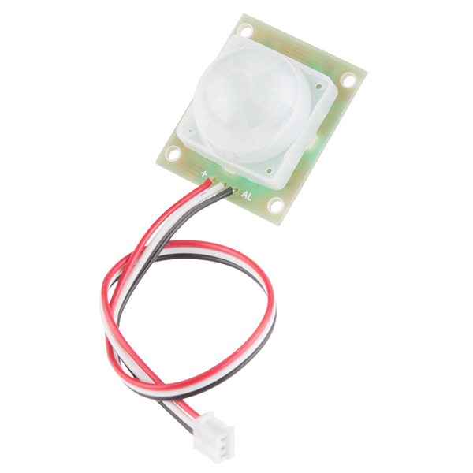

<!-- headingDivider: 2 -->

# PIR - Passive Infrared Sensor

  


## Wiring

| PIR (Sparkfun)      | Photon 2                                                 |
| ------------------- | -------------------------------------------------------- |
| + **(red wire)**    | 5v                                                       |
| - **(white wire)**  | GND                                                      |
| AL **(black wire)** | digital input pin <br />(with 10K pullup resistor to 5v) |

| Open PIR (Sparkfun) | Photon 2                  |
| ------------------- | ------------------------- |
| VCC                 | 3.3v                      |
| GND                 | GND                       |
| OUT                 | Any digital pin           |
| A                   | (Optional) Any analog pin |

*Note: The wire color and pin order is specific to the [Sparkfun PIR sensor](https://www.sparkfun.com/products/13285) and not all PIR sensor*s

## Wiring Guide


## Operation (Sparkfun PIR)

* Requires 1-2 sec delay in `setup()` to get initial reading from room
* Digital output from `AL` pin
* `HIGH` when no movement detected
* `LOW` when movement detected
* Signal remains active `low` for about 3 sec **after** movement (*documentation says 15 sec but that doesn't seem accurate*)

## Code

This is a basic example where any movement triggers alarm. More sophisticated use can include `millis()`

```c++
const int MOTION_PIN = D2;  // Pin connected to motion detector

void setup() {
    Serial.begin(9600);
    pinMode(MOTION_PIN, INPUT);
    delay(10000);  // wait to read the room
}

void loop() {
    int proximity = digitalRead(MOTION_PIN);
    if (proximity == LOW)  // If the sensor's output goes low, motion is detected
    {
        Serial.println("Motion detected!");
    } else {
        Serial.println("Motion stopped!");
    }
}

```


## Credit

* [Sparkfun](https://www.sparkfun.com/products/13285)
* Diagrams created with [Frizting](https://fritzing.org)


