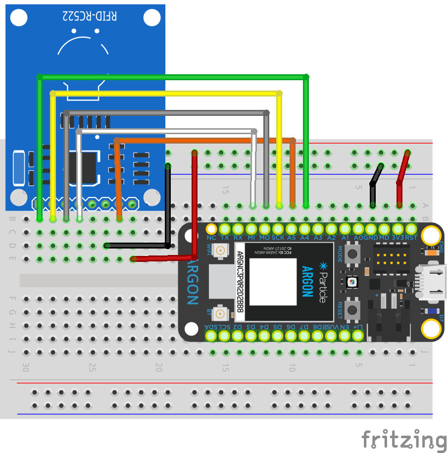

<!-- headingDivider: 2 -->

# RFID - Radio Frequency ID 

## Wiring 

- Uses SPI communication protocol

| Sensor | Argon                  |
| ------ | ---------------------- |
| 3.3v   | 3.3v                   |
| Reset  | Any digital output pin |
| GND    | GND                    |
| IRQ    | -                      |
| MOSI   | MO                     |
| MISO   | MI                     |
| SCK    | SCK                    |
| SDA    | Any digital output pin |

## Wiring Diagram

## Operation

### Library

* We need a library to handle much of the complex communication with the OLED 
* To install a library, go to the command palette and type `Install Library`
* Install the OLED library: `MFRC522`

### Examples

- There are extensive examples in the library folder under `lib/examples`

## Code

- See the in-class exercises and notes for more detailed examples

## Credit

* [Sparkfun](https://www.sparkfun.com/products/13285)

