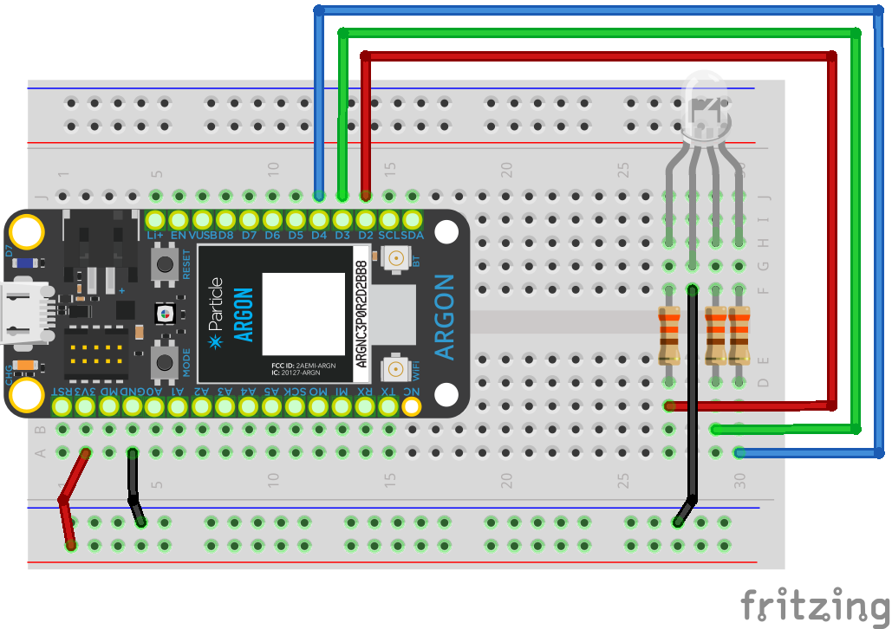

<!-- headingDivider: 2 -->

# RGB LEDs

## Pins


* RGB LEDs have four pins
* Three pins to each of R, G, B *(shorter pins)*
* One pin serves as either common anode or common cathode *(longer pin)*


## Wiring (Common Cathode)



* R, G, B pins are **anode** (*positive*)
* Connect **cathode** (longer pin) to **Ground** (*negative*)
* These are **physically** the opposite of regular LEDs

  * Regular LED: **anode** is longer pin
  * Common cathode RGB LED: **cathode** is longer pin

## Operation

### Digital Write

* Each LED color is either **on** or **off** 
* Output `HIGH` to anode turns that LED color on
* Output `LOW` to anode turns that LED color off

### Analog Write

* Use **pulse width modulation**
* Each LED color can have a brightness level that varies from `0` to `255`
* You can blend LEDs to create many different colors 

### Color Mixing

* Check out [https://htmlcolorcodes.com/]( https://htmlcolorcodes.com/ ) to see how R, G, and B mix to create colors


## Code

```c++
const int PIN_RED = D2;
const int PIN_GREEN = D3;
const int PIN_BLUE = D4;

void setup() {
  pinMode(PIN_RED, OUTPUT);
  pinMode(PIN_BLUE, OUTPUT);
  pinMode(PIN_GREEN, OUTPUT);
}

void loop() {
  //digital write - White (R + G + B)
  digitalWrite(PIN_RED, HIGH);
  digitalWrite(PIN_GREEN, HIGH);
  digitalWrite(PIN_BLUE, HIGH);
  delay(1000);
    
  //digital write - Magenta (R + B)
  digitalWrite(PIN_RED, HIGH);
  digitalWrite(PIN_GREEN, LOW);
  digitalWrite(PIN_BLUE, HIGH);
  delay(1000);

  //analog write - White (R 255 + G 255 + B 255)
  analogWrite(PIN_RED, 255);
  analogWrite(PIN_GREEN, 255);
  analogWrite(PIN_BLUE, 255);
  delay(1000);

  //analog write - Orange (R 255 + G 165 + B 0)
  analogWrite(PIN_RED, 255);
  analogWrite(PIN_GREEN, 165);
  analogWrite(PIN_BLUE, 0);
  delay(1000);
}
```


## Credit

- <a href="https://creativecommons.org/licenses/by-sa/3.0" title="Creative Commons Attribution-Share Alike 3.0">CC BY-SA 3.0</a>, <a href="https://commons.wikimedia.org/w/index.php?curid=755036">Source</a>
- [Sparkfun](https://learn.sparkfun.com/tutorials/pulse-width-modulation)
- Images created with [Fritzing](https://fritzing.org/home/)

