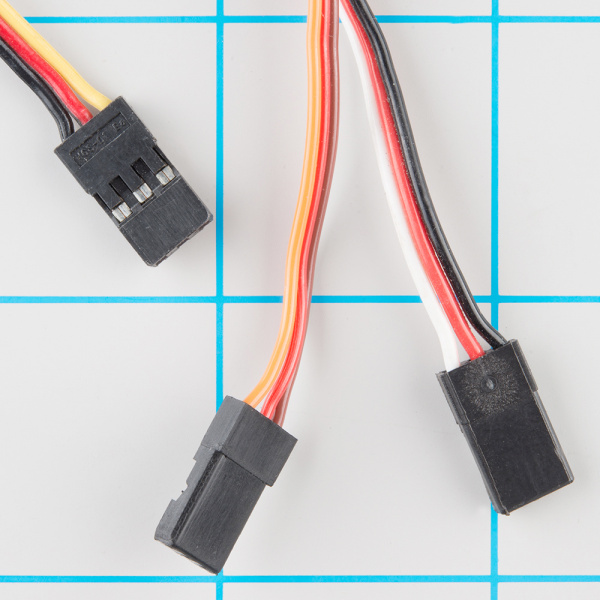

---

marp: true
theme: itp

category: reference
title: (Reference) Servo Motors
show_in_list: true

---

<!-- headingDivider: 2 -->

# Servo Motors


## Wiring Diagram


## Wiring Guide

| Servo Wire | Photon 2            |
| ---------- | ------------------- |
| Power      | VUSB                |
| Ground     | GND                 |
| Signal     | Any PWM-capable pin |

- **Important:** Most servos will require **5V** not **3.3V** so use `VUSB` 
- If you want to use a servo with a LiPo battery, see [these instructions](../../reference/general/power_5V_devices_from_battery) 

### Notes on Servo Wire Colors

* The wiring colors vary with different servos so look carefully at your documentation




## Operation

- Servo rotates 180 degrees based on input
- Use `Servo` class to allow you to send rotation values directly to servo
- It is recommended to rotate from 15 degrees to 165 degrees (instead of 0-180) to protect the servo from damage

## Code

```c++
const int SERVO_PIN = A2;

Servo servoObj;	// step 1: Create the servo object
void setup(){
    // step 2: attach the servo object to the servo pin 
    servoObj.attach(SERVO_PIN);
}

void loop(){
    // step 3: write PWM values to servo pin
    
    servoObj.write(15); //write the servo to position 15 degrees
    delay(1000); //wait one second
    servoObj.write(90); //write the servo to position 90 degrees
    delay(1000);
    servoObj.write(165); //write servo to position 165 degrees
    delay(1000);
}
```

## Jitting

- In some cases, the servo may start to make noise, stutter, or become hot when not it use
- This can be due to a variety of factors such as unstable current supply or interrupts in the Photon 2 execution
- IF this happens, one simple solution is to `attach` before using the servo, and then `detach` after

## Code: Fixing Jittering 

```c++
const int SERVO_PIN = A2;
Servo servoObj;
void setup(){ /*no attach code */ }
}
void loop(){
    servoObj.attach(SERVO_PIN);
    servoObj.write(15); //write the servo to position 15 degrees
    delay(1000); //wait one second
    servoObj.write(90); //write the servo to position 90 degrees
    servoObj.detach();
}
```

## Reminder: Photon 2 PWM Pins

* All PWM pins on the Photon 2 are assigned to the same timer, meaning you can only generate ONE frequency at a time (you cannot make different servos move in different directions at the same time)
  * PWM pins: A2, A5, D15 (MO), D16 (MI), D1 (SCL)


## Credits

* Images created with [Fritzing](https://fritzing.org/home/)
* [Sparkfun](https://learn.sparkfun.com/tutorials/servo-trigger-hookup-guide/all)
* [Sparkfun](https://www.sparkfun.com/products/14760)


