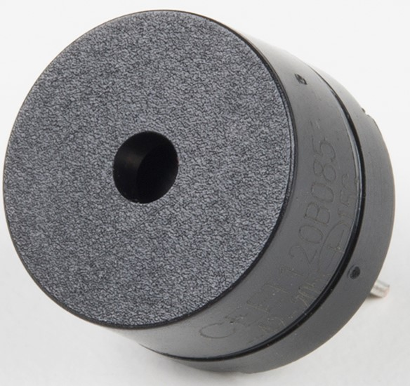

<!-- headingDivider: 2 -->

# Speakers / Piezo Buzzers
## Piezo Buzzer

  

## Wiring


### Wiring: Polarity

- The buzzer will have a **+** on the bottom or side 
- `+` goes to Photon 2 pin capable of PWM
- `-` goes to Ground

  


## Operation

* Uses PWM to generate square waves tones up to about 2 KHz

## Code: `tone()` 

- The `tone()` function produces tones from the buzzer

**Syntax**

```c++
tone(<<PIN>>, <<FREQUENCY>>, <<DURATION>>);
```

* `tone()` generates a square wave using PWM (50% duty cycle)

* `pin` is connected the speaker

* `frequency` is sound frequency in Hz (20Hz to 20KHz)

* `duration` is the length of tone in milliseconds 

## Code

  Example


```c++
const int PIN_SPEAKER = A5;

void setup() {
  pinMode(PIN_SPEAKER, OUTPUT);
}

void loop() {
  tone(PIN_SPEAKER, 500, 1500);	// play 500Hz tone for 1000ms (1 sec)
  // delay(1500);       // it may be necessary to add equal length delay
}
```

## Optional: Controlling Volume

* It is possible to add a potentiometer which can be used to control the volume of the buzzer. See full class notes on buzzers for more information
* `tone()` requires a pin that supports PWM

## Optional: Playing Melodies

### Musical Notes

* Musical notes can represented as constants
* Add this file ([pitches.h](pitches.h)) to your `src` folder and then add `#include "pitches.h"` to your sketch

* You can then refer to music notes with constants like `NOTE_C4` which is "middle C" on a piano

### Musical Note Lengths

* Tone lengths can be represented as musical beats
* Using an array for notes and an array for lengths, you can then create melodies with similar to using musical notation
* You can include can include the musical note

### Code

```c++
#include "pitches.h"	// you need to download this file to your SRC folder

const int PIN_SPEAKER = A5;

// notes in the melody:
int melody[] = {NOTE_C4, NOTE_G3, NOTE_G3, NOTE_A3,
                 NOTE_G3, 0,       NOTE_B3, NOTE_C4};

// note lengths: 4 = quarter note, 8 = eighth note, etc.:
int noteLengths[] = {4, 8, 8, 4, 4, 4, 4, 4};

void setup() {
  pinMode(PIN_SPEAKER, OUTPUT);
}

void loop() {
  for (int currentNote = 0; currentNote < 8; currentNote++) {
    // to calculate the note duration, take one second
    // divided by the note type.
    // e.g. quarter note = 1000 / 4, eighth note = 1000/8, etc.
    int currentNoteLength = 1000 / noteLengths[currentNote];
    tone(PIN_SPEAKER, melody[currentNote], currentNoteLength);

    // to distinguish the notes, set a minimum time between them.
    // the note's duration + 30% seems to work well:
    int pauseBetweenNotes = currentNoteLength * 1.30;
    delay(pauseBetweenNotes);
  }
}
```

### Finding Notes of Popular Songs

* [Notes for some popular songs](https://dragaosemchama.com/en/2019/02/songs-for-arduino/) (note that the format for playing notes is different in this code, but you can still extract the notes and duration from these examples)
* [MIDI to C converter](https://projects.neutonfoo.com/mc-piezo/) allows you convert a MIDI file directly into C


## Reminder: Photon 2 and `tone()`

* `tone()` requires a pin that supports PWM

* All PWM pins on the Photon 2 are assigned to the same timer, meaning you can only generate ONE frequency at a time (you cannot play different notes with different buzzers at the same time)
  * PWM pins: A2, A5, D15 (MO), D16 (MI), D1 (SCL)
  
  

## References

* Images created with [Fritzing](https://fritzing.org/home/)
* [Pixabay](https://pixabay.com/illustrations/banner-header-sound-wave-music-1571999/)
* [Sparkfun](https://learn.sparkfun.com/tutorials/sparkfun-inventors-kit-experiment-guide---v40/circuit-2a-buzzer)
