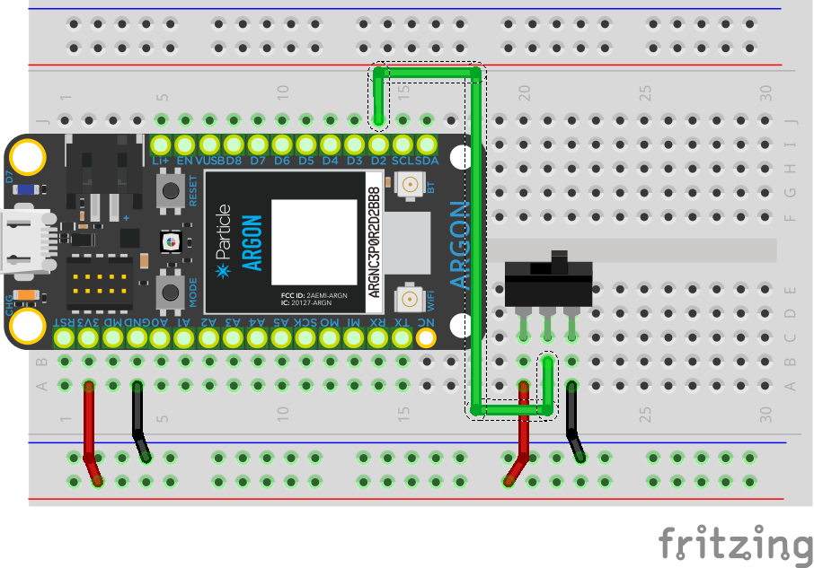
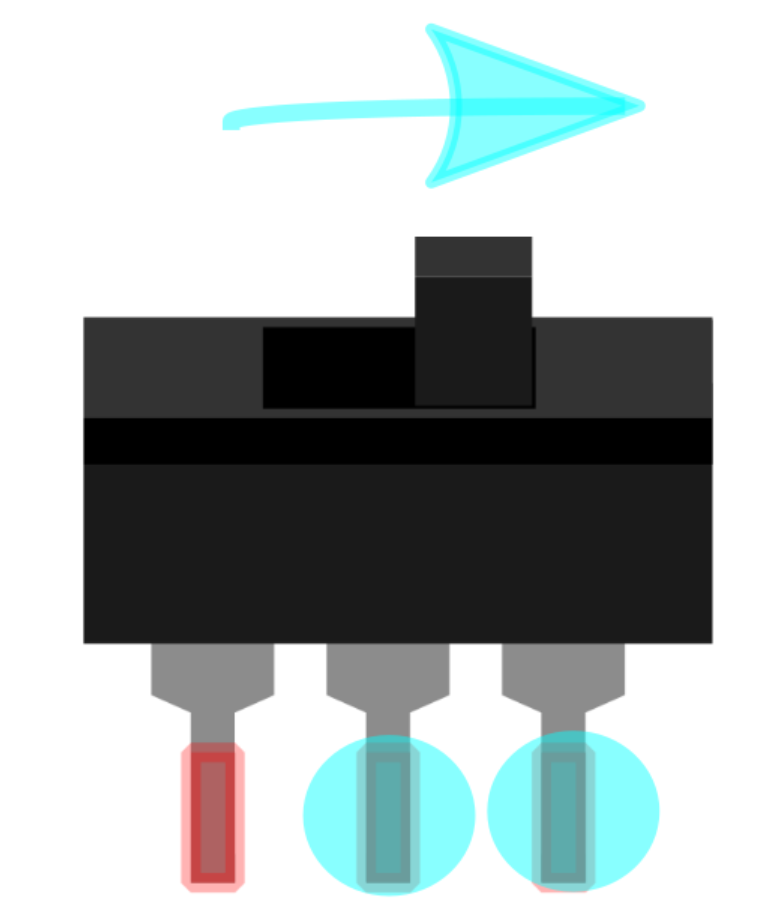

<!-- headingDivider: 2 -->

# Switches

## Wiring

## Operations

* Similar to pushbuttons, switches open or close a circuit
* We are going to look at **maintained switches** that continue to close or open a circuit indefinitely
* We will typically just call these components "switches"

### Connections

## Code

## Credit

- [Sparkfun](https://learn.sparkfun.com/tutorials/switch-basics/all) has some great illustrations on this for a deep dive into switches
- Images created with [Fritzing](https://fritzing.org/home/)

