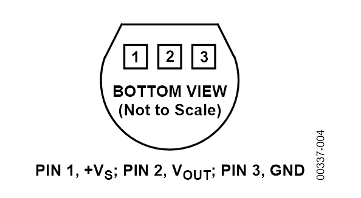

<!-- headingDivider: 2 -->

# TMP36 Analog Temperature Sensor


## Wiring

Requires analog input pin (Pins `A0`-`A5`)


### Orientation



- Note that is **BOTTOM VIEW**

## Operation

* Analog temperature sensor
* Measures environment temperature and returns a voltage
* Since this is an analog input, we use **analog to digital conversion** to read input
* Voltage on pin will varies 0v to 3.v, and Argon will read 0 to 4095 

### Conversions

- 10 mV per deg C with a 0.5 v offset
- `voltage = ADC_val / 4095 * 3.3` 
- `tempCelsius = (voltage - 0.5) * (1 / 0.01)` 
- `tempFahrenheit = tempCelsius * (9/5) + 32`

### Important: C++ `int` and `float`

- Division with `ints` in C++ truncates decimals

```c++
int x = 3;
int y = 6;
float result = x / y; // 0 since 3/6 is truncated` 
```

  - Instead, make sure to **cast** (convert) one of the `int` values to be a `float`

```c++
int x = 3;
int y = 6;
float result = (float) x / y;
```

​    

## Code

```c++
const int PIN_TMP = A5;

void setup() {
    Serial.begin(9600);
    pinMode(PIN_TMP, INPUT);
}

void loop() {
    // read ADC value
    int val = analogRead(pin_temp);  // range 0-4095 ADC
    
    // calculate voltage from ADC
    float voltage = (float)val / 4095 * 3.3;
    
    // calculate celsius from voltage
    float tempC = (voltage - 0.5) / 0.01;
    
    //convert to fahrenheit
    float tempF = tempC * (9.0 / 5) + 32;
}
```


## Credit

- [Analog datasheet](https://cdn.sparkfun.com/datasheets/Sensors/Temp/TMP35_36_37.pdf)
- [Sparkfun](https://www.sparkfun.com/products/10988)
- Images created with [Fritzing](https://fritzing.org/home/)


