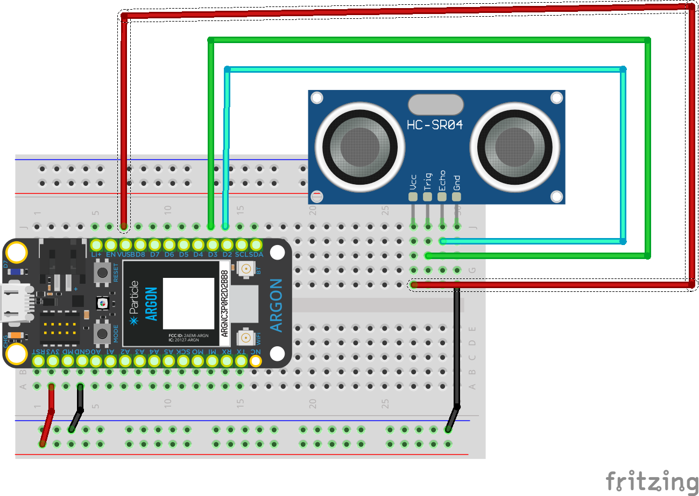

<!-- headingDivider: 2 -->


# Ultrasonic Distance Sensor


## Wiring

| Sensor | Argon      | Function                                                     |
| ------ | ---------- | ------------------------------------------------------------ |
| GND    | GND        | Ground                                                       |
| VCC    | VUSB       | Power **(requires 5v, but will work with 3.7V LiPo battery)** |
| TRIG   | Output Pin | start output pulse sequence                                  |
| ECHO   | Input Pin  | receive reflection response                                  |

## Wiring Diagram




## Operation

* Operating range: 2 cm - 4 m (1 in - 13 ft)

* Angle: 15 degrees

  

## Timing Diagram


## Timing Part 1: Trigger

* Output sequence
  * LOW for 2 microseconds 
  * HIGH for 10 microseconds
  * LOW

* Sensor sends out 8 sonic pulses

## Timing Part 2: Echo

* Sensor "listens" for sound wave to reflect / bounce off object
* When sound wave reflection is received, echo pin goes **HIGH** for duration of reflection, then goes **LOW**
* In order to measure the time it takes for an input to be received, use the ```pulseIn()```

## Code

```c++
const int PIN_TRIGGER = D3;
const int PIN_ECHO = D2;
double SPEED_SOUND_CM_ROOM_TEMP_FAHR = 0.03444;
int MAX_RANGE_CM = 78;
int MIN_RANGE_CM = 0;
double distanceCm;

void setup() {
    Serial.begin(9600);
    pinMode(PIN_TRIGGER, OUTPUT);
    pinMode(PIN_ECHO, INPUT);
}

void loop() {
    // start trigger
    digitalWrite(PIN_TRIGGER, LOW);  // prepare
    delayMicroseconds(2);
    digitalWrite(PIN_TRIGGER, HIGH);  // prepare
    delayMicroseconds(10);
    digitalWrite(PIN_TRIGGER, LOW);  // prepare

    int timeRoundTrip = pulseIn(PIN_ECHO, HIGH);  // wait for round trip time
    distanceCm = timeRoundTrip * SPEED_SOUND_CM_ROOM_TEMP_FAHR / 2;

    Serial.print("Dist to object:");
    if (distanceCm >= MAX_RANGE_CM ||
        distanceCm <= MIN_RANGE_CM) {  // sensor reports values in CM

        Serial.print("out of range");
    } else {
        Serial.print(distanceCm);
        Serial.print(" cm");
    }
    Serial.println();
    delay(500);
}
```
## Credit

- [Sparkfun](https://www.sparkfun.com/products/15569)
- [Sensor Datasheet](https://cdn.sparkfun.com/datasheets/Sensors/Proximity/HCSR04.pdf)

