<!-- NB: When updating the part URLs from a spreadsheet, markdown won't interpret the URLs as links. To fix this, copy the table source code into a text editor and do regex find / replace.
source: (https:\/\/[a-zA-Z0-9.\/=_\-\?\&]*)
replace: [($1]\(($1)\)      -->

## Custom Course Kit

We have a custom kit for the course, which was packaged and provided by the great people at [Sparkfun](https://www.sparkfun.com/). Students will need to purchase this course kit in lieu of a textbook. In addition to items in the course kit, ITP will provide enrolled students with an [Argon](https://store.particle.io/products/argon) microcontroller and a few extra components.

### Kit Contents

Prices listed retail prices at Sparkfun's [website](https://www.sparkfun.com), not the cost of the items when bundled in the kit (which are lower but not shared with me).

| Names                                                                 | Quantity | Price (USD) | URL                                     | Image                             |
|----------|-------------|----------|-----------------------------------------|-----------------------------------------|
| LiPo Battery                                          | 1        | $12.95      | [https://www.sparkfun.com/products/18286](https://www.sparkfun.com/products/18286) | 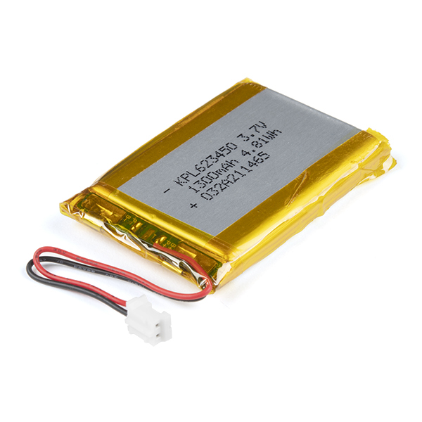 |
| Mini Speaker - PC Mount 12mm 2.048kHz                 | 1        | $1.95       | [https://www.sparkfun.com/products/7950](https://www.sparkfun.com/products/7950) | 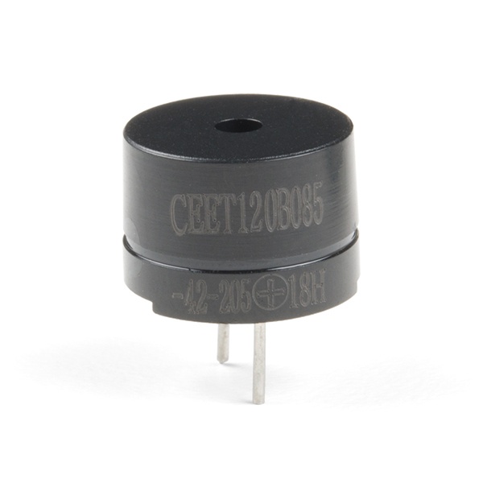 |
| Servo - Generic (Sub-Micro Size)                      | 2        | $1.97       | [https://www.sparkfun.com/products/9065](https://www.sparkfun.com/products/9065) |  |
| Piezo Element                                         | 1        | $1.50       | [https://www.sparkfun.com/products/10293](https://www.sparkfun.com/products/10293) |  |
| Wheel - 65mm (Rubber Tire, Pair)                      | 1        | $2.95       | [https://www.sparkfun.com/products/13259](https://www.sparkfun.com/products/13259) |  |
| Shadow Chassis                                        | 1        | $14.95      | [https://www.sparkfun.com/products/14332](https://www.sparkfun.com/products/14332) | 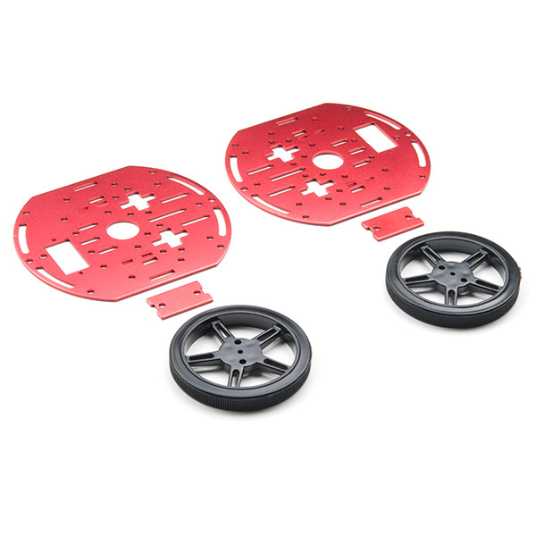 |
| Hobby Gearmotor - 140 RPM (Pair)                      | 1        | $4.95       | [https://www.sparkfun.com/products/13302](https://www.sparkfun.com/products/13302) |  |
| Magnetic Door Switch Set                              | 1        | $3.50       | [https://www.sparkfun.com/products/13247](https://www.sparkfun.com/products/13247) |  |
| Ultrasonic Distance Sensor - HC-SR04                  | 1        | $3.95       | [https://www.sparkfun.com/products/13959](https://www.sparkfun.com/products/13959) |  |
| DHT20 Temperature Sensor                              | 1        | $2.20       | [https://www.sparkfun.com/products/18364](https://www.sparkfun.com/products/18364) | 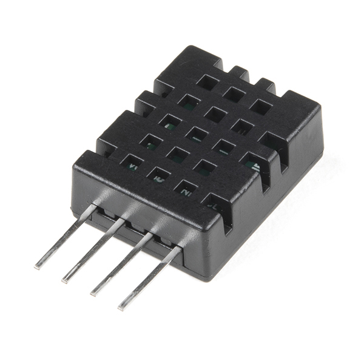 |
| Pulse Sensor                                          | 1        | $26.95     | [https://www.sparkfun.com/products/11574](https://www.sparkfun.com/products/11574) |  |
| SparkFun Motor Driver - Dual TB6612FNG (with Headers) | 1        | $13.95  | [https://www.sparkfun.com/products/14450](https://www.sparkfun.com/products/14450) |  |
| SparkFun Triple Axis Accelerometer Breakout - ADXL345 | 1        | $20.95   | [https://www.sparkfun.com/products/9836](https://www.sparkfun.com/products/9836) |  |
| Mini Screwdriver                                      | 1        | $0.95       | [https://www.sparkfun.com/products/9146](https://www.sparkfun.com/products/9146) | 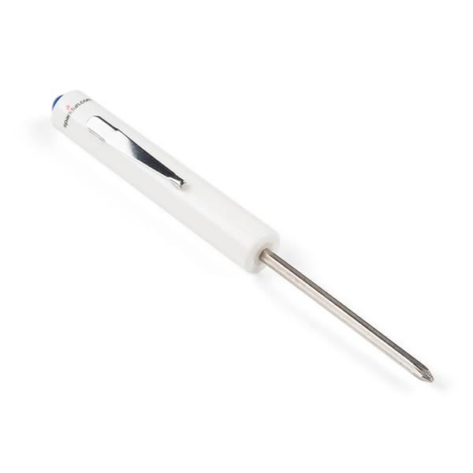 |
| SparkFun Micro OLED Breakout (Qwiic)                  | 1        | $16.95      | [https://www.sparkfun.com/products/14532](https://www.sparkfun.com/products/14532) |  |

### Components provided by ITP

Prices reflect Particle's Wholesale / Education discount and sales tax in Los Angeles, but do <u>not</u> include shipping costs.

| Name                                             | Quantity | Price (USD) | URL                                                          | Image                                                        |
| ------------------------------------------------ | -------- | ----------- | ------------------------------------------------------------ | ------------------------------------------------------------ |
| Fritzing                                         | 1        | $8.00       | [https://fritzing.org/](https://fritzing.org/)               |                                                              |
| Particle Argon                                   | 1        | $25.00      | [https://store.particle.io/products/argon-kit](https://store.particle.io/products/argon-kit) | 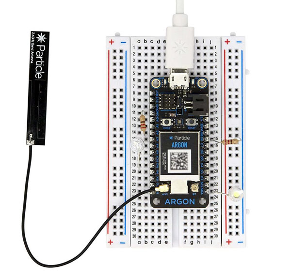                               |
| USB Cable                                        | 1        | $2.00       | [https://www.monoprice.com/product?p_id=13919](https://www.monoprice.com/product?p_id=13919) |                                                              |
| Qwiic cable - Breadboard jumper 4 pin            | 2        | $1.50       | [https://www.sparkfun.com/products/14425](https://www.sparkfun.com/products/14425) |          |
| Qwiic Cable - 200mm                              | 1        | $1.60       | [https://www.sparkfun.com/products/17258](https://www.sparkfun.com/products/17258) | 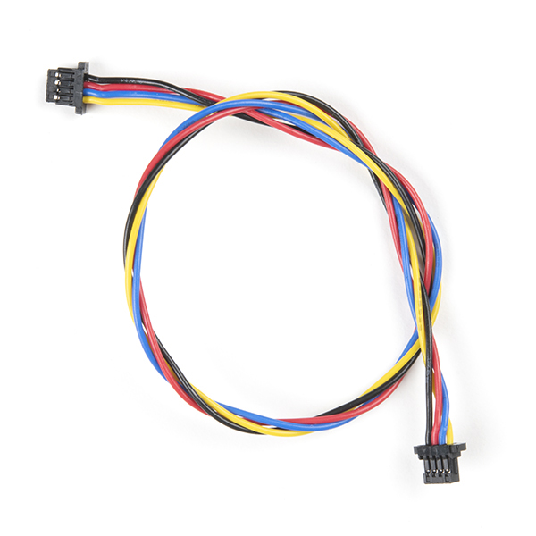                   |
| Mini Photocell                                   | 1        | $1.50       | [https://www.sparkfun.com/products/9088](https://www.sparkfun.com/products/9088) |                |
| Breadboard - Mini                                | 2        | $1.50       | [https://www.sparkfun.com/products/12002](https://www.sparkfun.com/products/12002) |            |
| Breadboard - Full-Size                           | 1        | $6.50       | [https://www.sparkfun.com/products/12615](https://www.sparkfun.com/products/12615) |            |
| LED - RGB Diffused Common Cathode                | 3        | $0.19       | [https://www.sparkfun.com/products/16911](https://www.sparkfun.com/products/16911) | 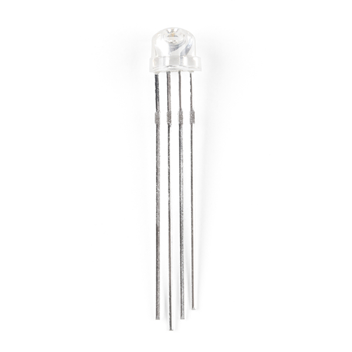                           |
| LED - Assorted (20 pack)                         | 1        | $3.30       | [https://www.sparkfun.com/products/12062](https://www.sparkfun.com/products/12062) |                                  |
| Adjustable Parts Box                             | 1        | $3.95       | [https://www.sparkfun.com/products/13867](https://www.sparkfun.com/products/13867) |                                    |
| Case                                             | 1        | $9.95       | [https://www.sparkfun.com/products/20695](https://www.sparkfun.com/products/20695) | 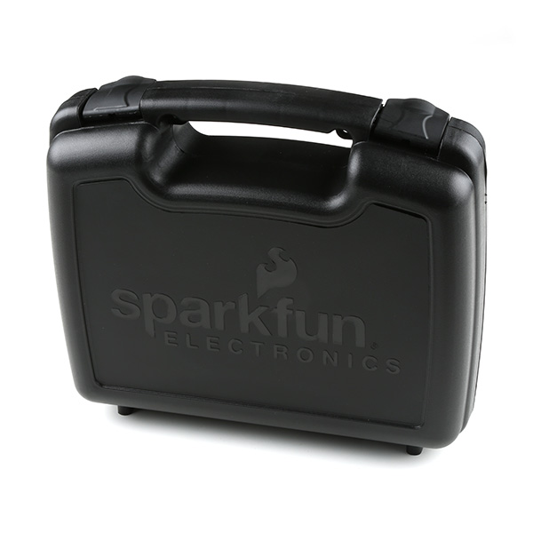                                 |
| Temperature Sensor - TMP36                       | 1        | $1.50       | [https://www.sparkfun.com/products/10988](https://www.sparkfun.com/products/10988) |                                |
| Trimpot 10K Ohm with Knob                        | 3        | $0.95       | [https://www.sparkfun.com/products/9806](https://www.sparkfun.com/products/9806) |                                    |
| Resistor Kit                                     | 1        | $8.95       | [https://www.sparkfun.com/products/10969](https://www.sparkfun.com/products/10969) | 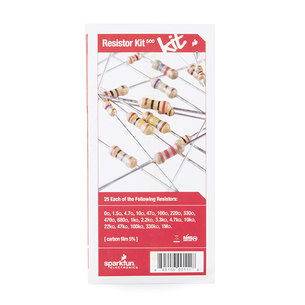                       |
| Mini Power Switch - SPDT                         | 3        | $0.59       | [https://www.sparkfun.com/products/9609](https://www.sparkfun.com/products/9609) |                              |
| Multicolor Buttons - 4-pack                      | 1        | $1.60       | [https://www.sparkfun.com/products/14460](https://www.sparkfun.com/products/14460) | 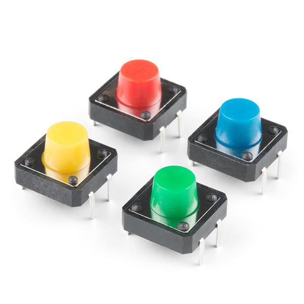                           |
| Jumper Wire Kit - 140pcs                         | 1        | $2.50       | [https://www.sparkfun.com/products/124](https://www.sparkfun.com/products/124) | 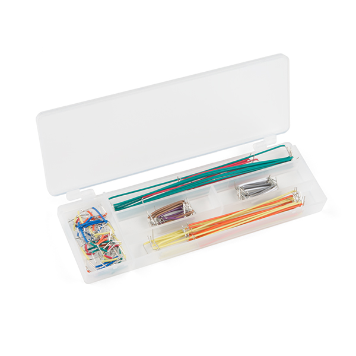           |
| Extension Jumper Wires                           | 10       | $0.13       | [https://www.sparkfun.com/products/9385](https://www.sparkfun.com/products/9385) |  |
| Fans for DC motors                               | 2        | $0.80       | [https://a.co/d/39zPwew](https://a.co/d/39zPwew)             | 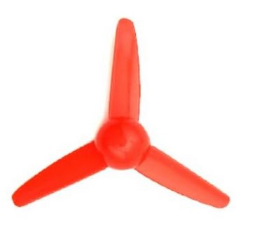                                 |
| Passive Infrared Sensor                          | 1        | $17.95      | [https://www.sparkfun.com/products/13968](https://www.sparkfun.com/products/13968) |                                    |
| HiLetgo RFID Kit                                 | 1        | $5.95       | [https://a.co/d/12BJTPz](https://a.co/d/12BJTPz)             | 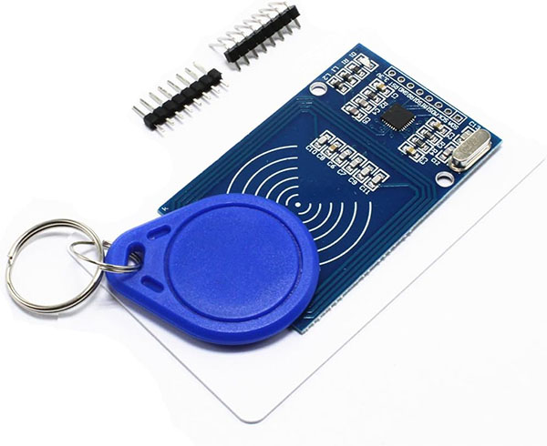                                 |
| 13.56MHz MIFARE Classic 1K RFID Smart Cards      | 2        | $0.35       | [https://a.co/d/7oRuANE](https://a.co/d/7oRuANE)             | 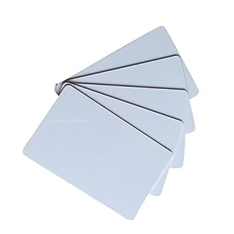                     |
| Dolphin Displacement Connnector (26-16AWG)       | 1        | $0.90       | [https://a.co/d/8LGO87W](https://a.co/d/8LGO87W)             | 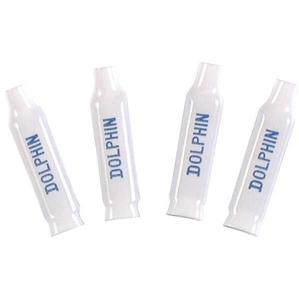                           |
| Envelopes                                        | 10       | $0.04       | [https://a.co/d/hJnvjuX](https://a.co/d/hJnvjuX)             |                        |
| SoftPot Membrane Potentiometer                   | 1        | $5.00       | [https://www.sparkfun.com/products/8680](https://www.sparkfun.com/products/8680) |                            |
| Amphenol receptable clincher                     | 1        | $0.95       | [https://www.sparkfun.com/products/14196](https://www.sparkfun.com/products/14196) | 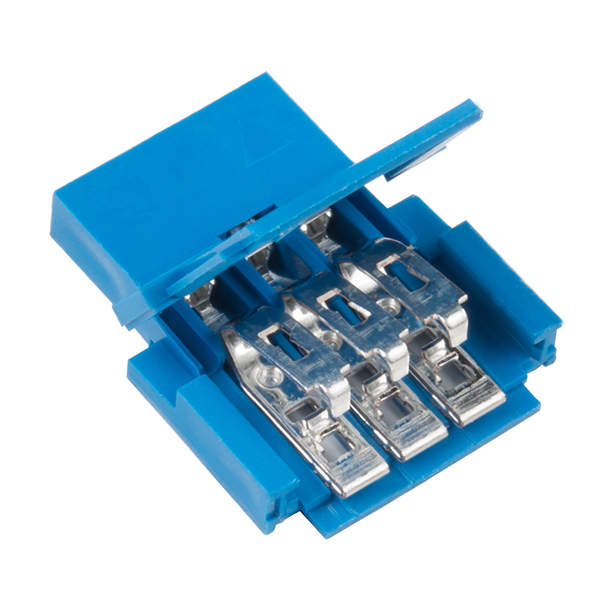                         |
| Plastic 1" wide Hook / Loop (Velcro) (in inches) | 12       | $0.10       | [https://a.co/d/50t6xz0](https://a.co/d/50t6xz0)             |                                                              |
| Velcro 2" wide loop (in inches)                  | 14       | $0.03       | [https://www.countrybrookdesign.com/2-inch-red-sew-on-loop-only.html](https://www.countrybrookdesign.com/2-inch-red-sew-on-loop-only.html) |                                                              |
| Velcro 1/2" wide hook (in inches)                | 2        | $0.02       | [https://www.countrybrookdesign.com/1-2-inch-sew-on-hook-only.html](https://www.countrybrookdesign.com/1-2-inch-sew-on-hook-only.html) |                                                              |